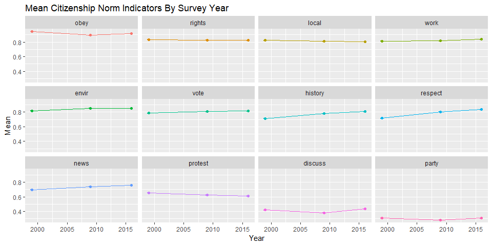

ICCS
================
Jenny
January, 2019

## Introduction

This file documents the data cleaning for the ICCS 1999-2009-2016
Citizenship Norms Project

Note that for citizenship norm recodes in all three survey waves, the
norms are coded in the descending mean order of the 1999 data:
obey,rights,local,work,envir,vote,history,respect,news,protest,discuss,party

## 1999 data loading and merging

1999 data:
<https://www.icpsr.umich.edu/icpsrweb/civicleads/studies/21661/datadocumentation>  
Downloaded Jan 17, 2019

Load 1999 country files, in chronological order of file names. Bind all
1999 files. Note, total observations of resulting tbl1 (93,882) concur
with xls documentation of expected total n

``` r
# all files
files <- list.files("../data", full.names = TRUE)

# helper function to load files
load_files <- function(file) {
  e <- new.env()
  load(file, envir = e)
  
  stopifnot(length(e) == 1)  # safety first
  
  get(names(e)[1], envir = e)
}

tbl1 <- files %>%
  magrittr::extract(1:28) %>%      # filter to 1999 files only
  map(~ .x %>%
        load_files() %>%
        select(COUNTRY, IDCNTRY, IDSTUD, BS3B1, BS3B11, BS3B9, BS3B4, BS3B13,
               BS3B2, BS3B6, BS3B10, BS3B8, BS3B5, BS3B12, BS3B3, GENDER,BSGBOOK, EXPEDUC, BSGEDUM, BSGEDUF, TOTWGT)) %>% 
  reduce(rbind) %>% 
  as_tibble() %>% 
  mutate(`ICCS_year` = 1999) %>%     # add survey year variable
  select(`ICCS_year`, everything())
```

Cit norm, count all indicators to begin recode.

``` r
original_vars <- tbl1 %>% 
  select(BS3B1, BS3B11, BS3B9, BS3B4, BS3B13, BS3B2, BS3B6, BS3B10, BS3B8, BS3B5, BS3B12, BS3B3) %>% 
  colnames() 

original_vars %>% 
  map(~ tbl1 %>% count(!!sym(.x)))
```

    ## Warning: Factor `BS3B1` contains implicit NA, consider using
    ## `forcats::fct_explicit_na`

    ## Warning: Factor `BS3B11` contains implicit NA, consider using
    ## `forcats::fct_explicit_na`

    ## Warning: Factor `BS3B9` contains implicit NA, consider using
    ## `forcats::fct_explicit_na`

    ## Warning: Factor `BS3B4` contains implicit NA, consider using
    ## `forcats::fct_explicit_na`

    ## Warning: Factor `BS3B13` contains implicit NA, consider using
    ## `forcats::fct_explicit_na`

    ## Warning: Factor `BS3B2` contains implicit NA, consider using
    ## `forcats::fct_explicit_na`

    ## Warning: Factor `BS3B6` contains implicit NA, consider using
    ## `forcats::fct_explicit_na`

    ## Warning: Factor `BS3B10` contains implicit NA, consider using
    ## `forcats::fct_explicit_na`

    ## Warning: Factor `BS3B8` contains implicit NA, consider using
    ## `forcats::fct_explicit_na`

    ## Warning: Factor `BS3B5` contains implicit NA, consider using
    ## `forcats::fct_explicit_na`

    ## Warning: Factor `BS3B12` contains implicit NA, consider using
    ## `forcats::fct_explicit_na`

    ## Warning: Factor `BS3B3` contains implicit NA, consider using
    ## `forcats::fct_explicit_na`

    ## [[1]]
    ## # A tibble: 5 x 2
    ##   BS3B1                        n
    ##   <fct>                    <int>
    ## 1 (1) not important         1995
    ## 2 (2) somewhat unimportant  2418
    ## 3 (3) somewhat important   20211
    ## 4 (4) very important       66431
    ## 5 <NA>                      2827
    ## 
    ## [[2]]
    ## # A tibble: 5 x 2
    ##   BS3B11                       n
    ##   <fct>                    <int>
    ## 1 (1) not important         2975
    ## 2 (2) somewhat unimportant 10785
    ## 3 (3) somewhat important   35630
    ## 4 (4) very important       38503
    ## 5 <NA>                      5989
    ## 
    ## [[3]]
    ## # A tibble: 5 x 2
    ##   BS3B9                        n
    ##   <fct>                    <int>
    ## 1 (1) not important         2986
    ## 2 (2) somewhat unimportant 11726
    ## 3 (3) somewhat important   42796
    ## 4 (4) very important       31396
    ## 5 <NA>                      4978
    ## 
    ## [[4]]
    ## # A tibble: 5 x 2
    ##   BS3B4                        n
    ##   <fct>                    <int>
    ## 1 (1) not important         5447
    ## 2 (2) somewhat unimportant 11830
    ## 3 (3) somewhat important   35762
    ## 4 (4) very important       35769
    ## 5 <NA>                      5074
    ## 
    ## [[5]]
    ## # A tibble: 5 x 2
    ##   BS3B13                       n
    ##   <fct>                    <int>
    ## 1 (1) not important         4064
    ## 2 (2) somewhat unimportant 12865
    ## 3 (3) somewhat important   36910
    ## 4 (4) very important       35383
    ## 5 <NA>                      4660
    ## 
    ## [[6]]
    ## # A tibble: 5 x 2
    ##   BS3B2                        n
    ##   <fct>                    <int>
    ## 1 (1) not important         4566
    ## 2 (2) somewhat unimportant 13382
    ## 3 (3) somewhat important   37364
    ## 4 (4) very important       35023
    ## 5 <NA>                      3547
    ## 
    ## [[7]]
    ## # A tibble: 5 x 2
    ##   BS3B6                        n
    ##   <fct>                    <int>
    ## 1 (1) not important         7861
    ## 2 (2) somewhat unimportant 17428
    ## 3 (3) somewhat important   32388
    ## 4 (4) very important       31589
    ## 5 <NA>                      4616
    ## 
    ## [[8]]
    ## # A tibble: 5 x 2
    ##   BS3B10                       n
    ##   <fct>                    <int>
    ## 1 (1) not important         6109
    ## 2 (2) somewhat unimportant 18138
    ## 3 (3) somewhat important   40898
    ## 4 (4) very important       22579
    ## 5 <NA>                      6158
    ## 
    ## [[9]]
    ## # A tibble: 5 x 2
    ##   BS3B8                        n
    ##   <fct>                    <int>
    ## 1 (1) not important         7319
    ## 2 (2) somewhat unimportant 18421
    ## 3 (3) somewhat important   42831
    ## 4 (4) very important       20869
    ## 5 <NA>                      4442
    ## 
    ## [[10]]
    ## # A tibble: 5 x 2
    ##   BS3B5                        n
    ##   <fct>                    <int>
    ## 1 (1) not important         8941
    ## 2 (2) somewhat unimportant 18358
    ## 3 (3) somewhat important   34180
    ## 4 (4) very important       22693
    ## 5 <NA>                      9710
    ## 
    ## [[11]]
    ## # A tibble: 5 x 2
    ##   BS3B12                       n
    ##   <fct>                    <int>
    ## 1 (1) not importnat        13954
    ## 2 (2) somewhat unimportant 34883
    ## 3 (3) somewhat important   28004
    ## 4 (4) very important        8959
    ## 5 <NA>                      8082
    ## 
    ## [[12]]
    ## # A tibble: 5 x 2
    ##   BS3B3                        n
    ##   <fct>                    <int>
    ## 1 (1) not important        23205
    ## 2 (2) somewhat unimportant 36163
    ## 3 (3) somewhat important   19853
    ## 4 (4) very important        6741
    ## 5 <NA>                      7920

Cit norm, count and recode 1st indicator as example.

``` r
# recode
tbl1 <- tbl1 %>% 
  mutate(BS3B1_binary = fct_collapse(BS3B1, 
  "not important" = c("(1) not important", "(2) somewhat unimportant"),
  "important"     = c("(3) somewhat important", "(4) very important")))

# confirm correct recode
tbl1 %>%
  count(BS3B1, BS3B1_binary) 
```

    ## Warning: Factor `BS3B1` contains implicit NA, consider using
    ## `forcats::fct_explicit_na`

    ## Warning: Factor `BS3B1_binary` contains implicit NA, consider using
    ## `forcats::fct_explicit_na`

    ## # A tibble: 5 x 3
    ##   BS3B1                    BS3B1_binary      n
    ##   <fct>                    <fct>         <int>
    ## 1 (1) not important        not important  1995
    ## 2 (2) somewhat unimportant not important  2418
    ## 3 (3) somewhat important   important     20211
    ## 4 (4) very important       important     66431
    ## 5 <NA>                     <NA>           2827

Repeat for all all cit norm indicators. NOTE: BS3B12 recoded separately
below b/c of typo in string variable.

``` r
tbl1 <-tbl1 %>% 
  mutate_at(vars(BS3B1, BS3B11, BS3B9, BS3B4, BS3B13, BS3B2, BS3B6, BS3B10, BS3B8, BS3B5, BS3B3),
            funs(bin = fct_collapse(.,
                                    "not important"= c("(1) not important", "(2) somewhat unimportant"),
                                    "important"    = c("(3) somewhat important", "(4) very important")))
  )
```

    ## Warning: funs() is soft deprecated as of dplyr 0.8.0
    ## please use list() instead
    ## 
    ## # Before:
    ## funs(name = f(.)
    ## 
    ## # After: 
    ## list(name = ~f(.))
    ## This warning is displayed once per session.

BS3B12 error troubleshoot when included in prior chunk. Count table
command below yields console output showing that string text of 1st
category “importnat” spelled incorrectly, i.e. “a” and “n” transposed.
BS3B12 “mutate” command to correctly recode with this typo:

``` r
# troubleshoot
tbl1 %>% count(BS3B12) 
```

    ## Warning: Factor `BS3B12` contains implicit NA, consider using
    ## `forcats::fct_explicit_na`

    ## # A tibble: 5 x 2
    ##   BS3B12                       n
    ##   <fct>                    <int>
    ## 1 (1) not importnat        13954
    ## 2 (2) somewhat unimportant 34883
    ## 3 (3) somewhat important   28004
    ## 4 (4) very important        8959
    ## 5 <NA>                      8082

``` r
# recode
tbl1 <- tbl1 %>% 
  mutate(BS3B12_bin = fct_collapse(BS3B12, 
                                   "not important" = c("(1) not importnat", "(2) somewhat unimportant"),
                                   "important"     = c("(3) somewhat important", "(4) very important"))
  )
```

Confirm successful mutates for all cit norms indicators.

``` r
bin_vars <- original_vars %>% 
  paste0("_bin")

map2(original_vars, bin_vars, ~ tbl1 %>% count(!!sym(.x), !!sym(.y)))
```

    ## Warning: Factor `BS3B1` contains implicit NA, consider using
    ## `forcats::fct_explicit_na`

    ## Warning: Factor `BS3B1_bin` contains implicit NA, consider using
    ## `forcats::fct_explicit_na`

    ## Warning: Factor `BS3B11` contains implicit NA, consider using
    ## `forcats::fct_explicit_na`

    ## Warning: Factor `BS3B11_bin` contains implicit NA, consider using
    ## `forcats::fct_explicit_na`

    ## Warning: Factor `BS3B9` contains implicit NA, consider using
    ## `forcats::fct_explicit_na`

    ## Warning: Factor `BS3B9_bin` contains implicit NA, consider using
    ## `forcats::fct_explicit_na`

    ## Warning: Factor `BS3B4` contains implicit NA, consider using
    ## `forcats::fct_explicit_na`

    ## Warning: Factor `BS3B4_bin` contains implicit NA, consider using
    ## `forcats::fct_explicit_na`

    ## Warning: Factor `BS3B13` contains implicit NA, consider using
    ## `forcats::fct_explicit_na`

    ## Warning: Factor `BS3B13_bin` contains implicit NA, consider using
    ## `forcats::fct_explicit_na`

    ## Warning: Factor `BS3B2` contains implicit NA, consider using
    ## `forcats::fct_explicit_na`

    ## Warning: Factor `BS3B2_bin` contains implicit NA, consider using
    ## `forcats::fct_explicit_na`

    ## Warning: Factor `BS3B6` contains implicit NA, consider using
    ## `forcats::fct_explicit_na`

    ## Warning: Factor `BS3B6_bin` contains implicit NA, consider using
    ## `forcats::fct_explicit_na`

    ## Warning: Factor `BS3B10` contains implicit NA, consider using
    ## `forcats::fct_explicit_na`

    ## Warning: Factor `BS3B10_bin` contains implicit NA, consider using
    ## `forcats::fct_explicit_na`

    ## Warning: Factor `BS3B8` contains implicit NA, consider using
    ## `forcats::fct_explicit_na`

    ## Warning: Factor `BS3B8_bin` contains implicit NA, consider using
    ## `forcats::fct_explicit_na`

    ## Warning: Factor `BS3B5` contains implicit NA, consider using
    ## `forcats::fct_explicit_na`

    ## Warning: Factor `BS3B5_bin` contains implicit NA, consider using
    ## `forcats::fct_explicit_na`

    ## Warning: Factor `BS3B12` contains implicit NA, consider using
    ## `forcats::fct_explicit_na`

    ## Warning: Factor `BS3B12_bin` contains implicit NA, consider using
    ## `forcats::fct_explicit_na`

    ## Warning: Factor `BS3B3` contains implicit NA, consider using
    ## `forcats::fct_explicit_na`

    ## Warning: Factor `BS3B3_bin` contains implicit NA, consider using
    ## `forcats::fct_explicit_na`

    ## [[1]]
    ## # A tibble: 5 x 3
    ##   BS3B1                    BS3B1_bin         n
    ##   <fct>                    <fct>         <int>
    ## 1 (1) not important        not important  1995
    ## 2 (2) somewhat unimportant not important  2418
    ## 3 (3) somewhat important   important     20211
    ## 4 (4) very important       important     66431
    ## 5 <NA>                     <NA>           2827
    ## 
    ## [[2]]
    ## # A tibble: 5 x 3
    ##   BS3B11                   BS3B11_bin        n
    ##   <fct>                    <fct>         <int>
    ## 1 (1) not important        not important  2975
    ## 2 (2) somewhat unimportant not important 10785
    ## 3 (3) somewhat important   important     35630
    ## 4 (4) very important       important     38503
    ## 5 <NA>                     <NA>           5989
    ## 
    ## [[3]]
    ## # A tibble: 5 x 3
    ##   BS3B9                    BS3B9_bin         n
    ##   <fct>                    <fct>         <int>
    ## 1 (1) not important        not important  2986
    ## 2 (2) somewhat unimportant not important 11726
    ## 3 (3) somewhat important   important     42796
    ## 4 (4) very important       important     31396
    ## 5 <NA>                     <NA>           4978
    ## 
    ## [[4]]
    ## # A tibble: 5 x 3
    ##   BS3B4                    BS3B4_bin         n
    ##   <fct>                    <fct>         <int>
    ## 1 (1) not important        not important  5447
    ## 2 (2) somewhat unimportant not important 11830
    ## 3 (3) somewhat important   important     35762
    ## 4 (4) very important       important     35769
    ## 5 <NA>                     <NA>           5074
    ## 
    ## [[5]]
    ## # A tibble: 5 x 3
    ##   BS3B13                   BS3B13_bin        n
    ##   <fct>                    <fct>         <int>
    ## 1 (1) not important        not important  4064
    ## 2 (2) somewhat unimportant not important 12865
    ## 3 (3) somewhat important   important     36910
    ## 4 (4) very important       important     35383
    ## 5 <NA>                     <NA>           4660
    ## 
    ## [[6]]
    ## # A tibble: 5 x 3
    ##   BS3B2                    BS3B2_bin         n
    ##   <fct>                    <fct>         <int>
    ## 1 (1) not important        not important  4566
    ## 2 (2) somewhat unimportant not important 13382
    ## 3 (3) somewhat important   important     37364
    ## 4 (4) very important       important     35023
    ## 5 <NA>                     <NA>           3547
    ## 
    ## [[7]]
    ## # A tibble: 5 x 3
    ##   BS3B6                    BS3B6_bin         n
    ##   <fct>                    <fct>         <int>
    ## 1 (1) not important        not important  7861
    ## 2 (2) somewhat unimportant not important 17428
    ## 3 (3) somewhat important   important     32388
    ## 4 (4) very important       important     31589
    ## 5 <NA>                     <NA>           4616
    ## 
    ## [[8]]
    ## # A tibble: 5 x 3
    ##   BS3B10                   BS3B10_bin        n
    ##   <fct>                    <fct>         <int>
    ## 1 (1) not important        not important  6109
    ## 2 (2) somewhat unimportant not important 18138
    ## 3 (3) somewhat important   important     40898
    ## 4 (4) very important       important     22579
    ## 5 <NA>                     <NA>           6158
    ## 
    ## [[9]]
    ## # A tibble: 5 x 3
    ##   BS3B8                    BS3B8_bin         n
    ##   <fct>                    <fct>         <int>
    ## 1 (1) not important        not important  7319
    ## 2 (2) somewhat unimportant not important 18421
    ## 3 (3) somewhat important   important     42831
    ## 4 (4) very important       important     20869
    ## 5 <NA>                     <NA>           4442
    ## 
    ## [[10]]
    ## # A tibble: 5 x 3
    ##   BS3B5                    BS3B5_bin         n
    ##   <fct>                    <fct>         <int>
    ## 1 (1) not important        not important  8941
    ## 2 (2) somewhat unimportant not important 18358
    ## 3 (3) somewhat important   important     34180
    ## 4 (4) very important       important     22693
    ## 5 <NA>                     <NA>           9710
    ## 
    ## [[11]]
    ## # A tibble: 5 x 3
    ##   BS3B12                   BS3B12_bin        n
    ##   <fct>                    <fct>         <int>
    ## 1 (1) not importnat        not important 13954
    ## 2 (2) somewhat unimportant not important 34883
    ## 3 (3) somewhat important   important     28004
    ## 4 (4) very important       important      8959
    ## 5 <NA>                     <NA>           8082
    ## 
    ## [[12]]
    ## # A tibble: 5 x 3
    ##   BS3B3                    BS3B3_bin         n
    ##   <fct>                    <fct>         <int>
    ## 1 (1) not important        not important 23205
    ## 2 (2) somewhat unimportant not important 36163
    ## 3 (3) somewhat important   important     19853
    ## 4 (4) very important       important      6741
    ## 5 <NA>                     <NA>           7920

Recode of individual-level control vars

``` r
tbl1 <- tbl1 %>% 
  mutate(female = ifelse(GENDER == "(0) Male", 0, 1),    # gender
         books = case_when(                              # books in respondent's home
           BSGBOOK == "(1) None"          ~ 0,
           BSGBOOK == "(2) 1 - 10"        ~ 0,
           BSGBOOK == "(3) 11 - 50"       ~ 1,
           BSGBOOK == "(4) 51 - 100"      ~ 1,
           BSGBOOK == "(5) 101 - 200"     ~ 2,
           BSGBOOK == "(6) More than 200" ~ 3
         ),
         edexp = case_when(                              # expected number of additional educ years
           EXPEDUC == "(0) 0"    ~ 0,
           EXPEDUC == "(1) 1-2"  ~ 0,
           EXPEDUC == "(2) 3-4"  ~ 0,
           EXPEDUC == "(3) 5-6"  ~ 1,
           EXPEDUC == "(4) 7-8"  ~ 1,
           EXPEDUC == "(5) 9-10" ~ 2,
           EXPEDUC == "(6) 10+"  ~ 2
         ),
         ed_mom = case_when(                             # mother education
           BSGEDUM == "(1) no.elem.school"          ~ 0,
           BSGEDUM == "(2) Fin. elem. sch."         ~ 0,
           BSGEDUM == "(3) Fin.s.high sch."         ~ 0,
           BSGEDUM == "(4) Fin.high sch."           ~ 1,
           BSGEDUM == "(5) Sme technic.educ. after" ~ 2,
           BSGEDUM == "(6) sme college,univ."       ~ 2,
           BSGEDUM == "(7) bach. degree"            ~ 2
         ),
         ed_dad = case_when(                             # father education
           BSGEDUF == "(1) No.elem.school"     ~ 0,
           BSGEDUF == "(2) Fin. elem. sch."    ~ 0,
           BSGEDUF == "(3) Fin.s.high sch."    ~ 0,
           BSGEDUF == "(4) Fin.high sch."      ~ 1,
           BSGEDUF == "(5) Sme techn.educ."    ~ 2,
           BSGEDUF == "(6) Sme college, univ." ~ 2,
           BSGEDUF == "(7) Bach. degree"       ~ 2
         )) 

# check recodes
sociodem_vars <- c("GENDER", "BSGBOOK", "EXPEDUC", "BSGEDUM", "BSGEDUF")
recoded_vars  <- c("female", "books", "edexp", "ed_mom", "ed_dad")

map2(recoded_vars, sociodem_vars, ~ tbl1 %>% count(!!sym(.x), !!sym(.y)))
```

    ## Warning: Factor `GENDER` contains implicit NA, consider using
    ## `forcats::fct_explicit_na`

    ## Warning: Factor `BSGBOOK` contains implicit NA, consider using
    ## `forcats::fct_explicit_na`

    ## Warning: Factor `EXPEDUC` contains implicit NA, consider using
    ## `forcats::fct_explicit_na`

    ## Warning: Factor `BSGEDUM` contains implicit NA, consider using
    ## `forcats::fct_explicit_na`

    ## Warning: Factor `BSGEDUF` contains implicit NA, consider using
    ## `forcats::fct_explicit_na`

    ## [[1]]
    ## # A tibble: 3 x 3
    ##   female GENDER         n
    ##    <dbl> <fct>      <int>
    ## 1      0 (0) Male   45214
    ## 2      1 (1) Female 47882
    ## 3     NA <NA>         786
    ## 
    ## [[2]]
    ## # A tibble: 7 x 3
    ##   books BSGBOOK               n
    ##   <dbl> <fct>             <int>
    ## 1     0 (1) None           1394
    ## 2     0 (2) 1 - 10         8620
    ## 3     1 (3) 11 - 50       21027
    ## 4     1 (4) 51 - 100      21409
    ## 5     2 (5) 101 - 200     17490
    ## 6     3 (6) More than 200 22963
    ## 7    NA <NA>                979
    ## 
    ## [[3]]
    ## # A tibble: 8 x 3
    ##   edexp EXPEDUC      n
    ##   <dbl> <fct>    <int>
    ## 1     0 (0) 0     1839
    ## 2     0 (1) 1-2   6705
    ## 3     0 (2) 3-4  23445
    ## 4     1 (3) 5-6  20336
    ## 5     1 (4) 7-8  19971
    ## 6     2 (5) 9-10 13236
    ## 7     2 (6) 10+   6931
    ## 8    NA <NA>      1419
    ## 
    ## [[4]]
    ## # A tibble: 8 x 3
    ##   ed_mom BSGEDUM                         n
    ##    <dbl> <fct>                       <int>
    ## 1      0 (1) no.elem.school           4003
    ## 2      0 (2) Fin. elem. sch.         10590
    ## 3      0 (3) Fin.s.high sch.         13044
    ## 4      1 (4) Fin.high sch.           20991
    ## 5      2 (5) Sme technic.educ. after  8047
    ## 6      2 (6) sme college,univ.        6366
    ## 7      2 (7) bach. degree            14229
    ## 8     NA <NA>                        16612
    ## 
    ## [[5]]
    ## # A tibble: 8 x 3
    ##   ed_dad BSGEDUF                    n
    ##    <dbl> <fct>                  <int>
    ## 1      0 (1) No.elem.school      3689
    ## 2      0 (2) Fin. elem. sch.     9783
    ## 3      0 (3) Fin.s.high sch.    12505
    ## 4      1 (4) Fin.high sch.      17891
    ## 5      2 (5) Sme techn.educ.     9309
    ## 6      2 (6) Sme college, univ.  5137
    ## 7      2 (7) Bach. degree       15120
    ## 8     NA <NA>                   20448

Select for LCA vars tibble, including rename all mutated variables and
display first five lines of dataframe.

``` r
tbl1 <- tbl1 %>%
  select(ICCS_year,
         COUNTRY,
         IDSTUD,
         TOTWGTS = TOTWGT,
         obey    = BS3B1_bin,
         rights  = BS3B11_bin,
         local   = BS3B9_bin,
         work    = BS3B4_bin,
         envir   = BS3B13_bin,
         vote    = BS3B2_bin,
         history = BS3B6_bin,
         respect = BS3B10_bin,
         news    = BS3B8_bin,
         protest = BS3B5_bin,
         discuss = BS3B12_bin,
         party   = BS3B3_bin,
         female,
         books,
         edexp,
         ed_mom,
         ed_dad)

tbl1 %>% head()
```

    ## # A tibble: 6 x 21
    ##   ICCS_year COUNTRY IDSTUD TOTWGTS obey  rights local work  envir vote 
    ##       <dbl> <fct>    <dbl>   <dbl> <fct> <fct>  <fct> <fct> <fct> <fct>
    ## 1      1999 AUS      10302    57.2 impo~ not i~ impo~ impo~ impo~ impo~
    ## 2      1999 AUS      10305    57.2 impo~ not i~ impo~ impo~ impo~ impo~
    ## 3      1999 AUS      10311    57.2 impo~ <NA>   <NA>  impo~ impo~ not ~
    ## 4      1999 AUS      10313    57.2 impo~ not i~ not ~ not ~ not ~ impo~
    ## 5      1999 AUS      10317    57.2 impo~ impor~ impo~ not ~ impo~ not ~
    ## 6      1999 AUS      10319    57.2 impo~ impor~ impo~ impo~ impo~ impo~
    ## # ... with 11 more variables: history <fct>, respect <fct>, news <fct>,
    ## #   protest <fct>, discuss <fct>, party <fct>, female <dbl>, books <dbl>,
    ## #   edexp <dbl>, ed_mom <dbl>, ed_dad <dbl>

## 2009 dataloading and merging

2009 data: <https://www.icpsr.umich.edu/icpsrweb/ICPSR/studies/36997>
Downloaded Jan 17, 2019

Load 2009 country files, in chronological order of file names. Bind all
2009 files; Note, total observations of resulting tbl2 (140,650) concur
with xls documentation of expected total n.

``` r
tbl2 <- files %>%
  magrittr::extract(29:66) %>%      # filter to 2009 files only
  map(~ .x %>%
        load_files() %>%
        select(COUNTRY, IDCNTRY, IDSTUD, IS2P21L, IS2P21I, IS2P21H, IS2P21K, IS2P21J, IS2P21A,
               IS2P21C, IS2P21E, IS2P21D, IS2P21G, IS2P21F, IS2P21B, SGENDER, IS2G11, IS2G03, IS2G07, IS2G09, TOTWGTS)) %>% 
  reduce(rbind) %>% 
  as_tibble() %>% 
  mutate(`ICCS_year` = 2009) %>%     # survey year variable creation
  select(`ICCS_year`, everything())
```

Cit norm, count all indicators to begin recode.

``` r
original_vars <- tbl2 %>% 
  select(IS2P21L, IS2P21I, IS2P21H, IS2P21K, IS2P21J, IS2P21A, IS2P21C, IS2P21E, IS2P21D, IS2P21G, IS2P21F, IS2P21B) %>% 
  colnames() 

original_vars %>% 
  map(~ tbl2 %>% count(!!sym(.x)))
```

    ## Warning: Factor `IS2P21L` contains implicit NA, consider using
    ## `forcats::fct_explicit_na`

    ## Warning: Factor `IS2P21I` contains implicit NA, consider using
    ## `forcats::fct_explicit_na`

    ## Warning: Factor `IS2P21H` contains implicit NA, consider using
    ## `forcats::fct_explicit_na`

    ## Warning: Factor `IS2P21K` contains implicit NA, consider using
    ## `forcats::fct_explicit_na`

    ## Warning: Factor `IS2P21J` contains implicit NA, consider using
    ## `forcats::fct_explicit_na`

    ## Warning: Factor `IS2P21A` contains implicit NA, consider using
    ## `forcats::fct_explicit_na`

    ## Warning: Factor `IS2P21C` contains implicit NA, consider using
    ## `forcats::fct_explicit_na`

    ## Warning: Factor `IS2P21E` contains implicit NA, consider using
    ## `forcats::fct_explicit_na`

    ## Warning: Factor `IS2P21D` contains implicit NA, consider using
    ## `forcats::fct_explicit_na`

    ## Warning: Factor `IS2P21G` contains implicit NA, consider using
    ## `forcats::fct_explicit_na`

    ## Warning: Factor `IS2P21F` contains implicit NA, consider using
    ## `forcats::fct_explicit_na`

    ## Warning: Factor `IS2P21B` contains implicit NA, consider using
    ## `forcats::fct_explicit_na`

    ## [[1]]
    ## # A tibble: 5 x 2
    ##   IS2P21L                      n
    ##   <fct>                    <int>
    ## 1 (1) VERY IMPORTANT       76977
    ## 2 (2) QUITE IMPORTANT      45856
    ## 3 (3) NOT VERY IMPORTANT   10022
    ## 4 (4) NOT IMPORTANT AT ALL  3961
    ## 5 <NA>                      3834
    ## 
    ## [[2]]
    ## # A tibble: 5 x 2
    ##   IS2P21I                      n
    ##   <fct>                    <int>
    ## 1 (1) VERY IMPORTANT       53959
    ## 2 (2) QUITE IMPORTANT      59698
    ## 3 (3) NOT VERY IMPORTANT   18844
    ## 4 (4) NOT IMPORTANT AT ALL  3862
    ## 5 <NA>                      4287
    ## 
    ## [[3]]
    ## # A tibble: 5 x 2
    ##   IS2P21H                      n
    ##   <fct>                    <int>
    ## 1 (1) VERY IMPORTANT       47674
    ## 2 (2) QUITE IMPORTANT      63169
    ## 3 (3) NOT VERY IMPORTANT   21124
    ## 4 (4) NOT IMPORTANT AT ALL  4368
    ## 5 <NA>                      4315
    ## 
    ## [[4]]
    ## # A tibble: 5 x 2
    ##   IS2P21K                      n
    ##   <fct>                    <int>
    ## 1 (1) VERY IMPORTANT       53170
    ## 2 (2) QUITE IMPORTANT      58047
    ## 3 (3) NOT VERY IMPORTANT   20006
    ## 4 (4) NOT IMPORTANT AT ALL  5379
    ## 5 <NA>                      4048
    ## 
    ## [[5]]
    ## # A tibble: 5 x 2
    ##   IS2P21J                      n
    ##   <fct>                    <int>
    ## 1 (1) VERY IMPORTANT       61438
    ## 2 (2) QUITE IMPORTANT      54712
    ## 3 (3) NOT VERY IMPORTANT   16255
    ## 4 (4) NOT IMPORTANT AT ALL  4043
    ## 5 <NA>                      4202
    ## 
    ## [[6]]
    ## # A tibble: 5 x 2
    ##   IS2P21A                      n
    ##   <fct>                    <int>
    ## 1 (1) VERY IMPORTANT       58412
    ## 2 (2) QUITE IMPORTANT      54399
    ## 3 (3) NOT VERY IMPORTANT   20691
    ## 4 (4) NOT IMPORTANT AT ALL  4019
    ## 5 <NA>                      3129
    ## 
    ## [[7]]
    ## # A tibble: 5 x 2
    ##   IS2P21C                      n
    ##   <fct>                    <int>
    ## 1 (1) VERY IMPORTANT       50412
    ## 2 (2) QUITE IMPORTANT      55702
    ## 3 (3) NOT VERY IMPORTANT   24553
    ## 4 (4) NOT IMPORTANT AT ALL  5582
    ## 5 <NA>                      4401
    ## 
    ## [[8]]
    ## # A tibble: 5 x 2
    ##   IS2P21E                      n
    ##   <fct>                    <int>
    ## 1 (1) VERY IMPORTANT       40616
    ## 2 (2) QUITE IMPORTANT      65090
    ## 3 (3) NOT VERY IMPORTANT   24294
    ## 4 (4) NOT IMPORTANT AT ALL  6739
    ## 5 <NA>                      3911
    ## 
    ## [[9]]
    ## # A tibble: 5 x 2
    ##   IS2P21D                      n
    ##   <fct>                    <int>
    ## 1 (1) VERY IMPORTANT       37359
    ## 2 (2) QUITE IMPORTANT      63832
    ## 3 (3) NOT VERY IMPORTANT   29728
    ## 4 (4) NOT IMPORTANT AT ALL  5920
    ## 5 <NA>                      3811
    ## 
    ## [[10]]
    ## # A tibble: 5 x 2
    ##   IS2P21G                      n
    ##   <fct>                    <int>
    ## 1 (1) VERY IMPORTANT       35362
    ## 2 (2) QUITE IMPORTANT      51996
    ## 3 (3) NOT VERY IMPORTANT   37311
    ## 4 (4) NOT IMPORTANT AT ALL 11557
    ## 5 <NA>                      4424
    ## 
    ## [[11]]
    ## # A tibble: 5 x 2
    ##   IS2P21F                      n
    ##   <fct>                    <int>
    ## 1 (1) VERY IMPORTANT       15669
    ## 2 (2) QUITE IMPORTANT      43337
    ## 3 (3) NOT VERY IMPORTANT   61418
    ## 4 (4) NOT IMPORTANT AT ALL 15929
    ## 5 <NA>                      4297
    ## 
    ## [[12]]
    ## # A tibble: 5 x 2
    ##   IS2P21B                      n
    ##   <fct>                    <int>
    ## 1 (1) VERY IMPORTANT       12868
    ## 2 (2) QUITE IMPORTANT      33456
    ## 3 (3) NOT VERY IMPORTANT   71041
    ## 4 (4) NOT IMPORTANT AT ALL 19402
    ## 5 <NA>                      3883

Recode all cit norm indicators.

``` r
tbl2 <- tbl2 %>% 
  mutate_at(vars(IS2P21L, IS2P21I, IS2P21H, IS2P21K, IS2P21J, IS2P21A, IS2P21C, IS2P21E, IS2P21D, IS2P21G, IS2P21F, IS2P21B),
            funs(bin = fct_collapse(.,
                                    "not important" = c("(3) NOT VERY IMPORTANT", "(4) NOT IMPORTANT AT ALL"),
                                    "important"     = c("(1) VERY IMPORTANT", "(2) QUITE IMPORTANT")))
  )
```

Confirm successful recodes.

``` r
bin_vars <- original_vars %>% 
  paste0("_bin")

map2(original_vars, bin_vars, ~ tbl2 %>% count(!!sym(.x), !!sym(.y)))
```

    ## Warning: Factor `IS2P21L` contains implicit NA, consider using
    ## `forcats::fct_explicit_na`

    ## Warning: Factor `IS2P21L_bin` contains implicit NA, consider using
    ## `forcats::fct_explicit_na`

    ## Warning: Factor `IS2P21I` contains implicit NA, consider using
    ## `forcats::fct_explicit_na`

    ## Warning: Factor `IS2P21I_bin` contains implicit NA, consider using
    ## `forcats::fct_explicit_na`

    ## Warning: Factor `IS2P21H` contains implicit NA, consider using
    ## `forcats::fct_explicit_na`

    ## Warning: Factor `IS2P21H_bin` contains implicit NA, consider using
    ## `forcats::fct_explicit_na`

    ## Warning: Factor `IS2P21K` contains implicit NA, consider using
    ## `forcats::fct_explicit_na`

    ## Warning: Factor `IS2P21K_bin` contains implicit NA, consider using
    ## `forcats::fct_explicit_na`

    ## Warning: Factor `IS2P21J` contains implicit NA, consider using
    ## `forcats::fct_explicit_na`

    ## Warning: Factor `IS2P21J_bin` contains implicit NA, consider using
    ## `forcats::fct_explicit_na`

    ## Warning: Factor `IS2P21A` contains implicit NA, consider using
    ## `forcats::fct_explicit_na`

    ## Warning: Factor `IS2P21A_bin` contains implicit NA, consider using
    ## `forcats::fct_explicit_na`

    ## Warning: Factor `IS2P21C` contains implicit NA, consider using
    ## `forcats::fct_explicit_na`

    ## Warning: Factor `IS2P21C_bin` contains implicit NA, consider using
    ## `forcats::fct_explicit_na`

    ## Warning: Factor `IS2P21E` contains implicit NA, consider using
    ## `forcats::fct_explicit_na`

    ## Warning: Factor `IS2P21E_bin` contains implicit NA, consider using
    ## `forcats::fct_explicit_na`

    ## Warning: Factor `IS2P21D` contains implicit NA, consider using
    ## `forcats::fct_explicit_na`

    ## Warning: Factor `IS2P21D_bin` contains implicit NA, consider using
    ## `forcats::fct_explicit_na`

    ## Warning: Factor `IS2P21G` contains implicit NA, consider using
    ## `forcats::fct_explicit_na`

    ## Warning: Factor `IS2P21G_bin` contains implicit NA, consider using
    ## `forcats::fct_explicit_na`

    ## Warning: Factor `IS2P21F` contains implicit NA, consider using
    ## `forcats::fct_explicit_na`

    ## Warning: Factor `IS2P21F_bin` contains implicit NA, consider using
    ## `forcats::fct_explicit_na`

    ## Warning: Factor `IS2P21B` contains implicit NA, consider using
    ## `forcats::fct_explicit_na`

    ## Warning: Factor `IS2P21B_bin` contains implicit NA, consider using
    ## `forcats::fct_explicit_na`

    ## [[1]]
    ## # A tibble: 5 x 3
    ##   IS2P21L                  IS2P21L_bin       n
    ##   <fct>                    <fct>         <int>
    ## 1 (1) VERY IMPORTANT       important     76977
    ## 2 (2) QUITE IMPORTANT      important     45856
    ## 3 (3) NOT VERY IMPORTANT   not important 10022
    ## 4 (4) NOT IMPORTANT AT ALL not important  3961
    ## 5 <NA>                     <NA>           3834
    ## 
    ## [[2]]
    ## # A tibble: 5 x 3
    ##   IS2P21I                  IS2P21I_bin       n
    ##   <fct>                    <fct>         <int>
    ## 1 (1) VERY IMPORTANT       important     53959
    ## 2 (2) QUITE IMPORTANT      important     59698
    ## 3 (3) NOT VERY IMPORTANT   not important 18844
    ## 4 (4) NOT IMPORTANT AT ALL not important  3862
    ## 5 <NA>                     <NA>           4287
    ## 
    ## [[3]]
    ## # A tibble: 5 x 3
    ##   IS2P21H                  IS2P21H_bin       n
    ##   <fct>                    <fct>         <int>
    ## 1 (1) VERY IMPORTANT       important     47674
    ## 2 (2) QUITE IMPORTANT      important     63169
    ## 3 (3) NOT VERY IMPORTANT   not important 21124
    ## 4 (4) NOT IMPORTANT AT ALL not important  4368
    ## 5 <NA>                     <NA>           4315
    ## 
    ## [[4]]
    ## # A tibble: 5 x 3
    ##   IS2P21K                  IS2P21K_bin       n
    ##   <fct>                    <fct>         <int>
    ## 1 (1) VERY IMPORTANT       important     53170
    ## 2 (2) QUITE IMPORTANT      important     58047
    ## 3 (3) NOT VERY IMPORTANT   not important 20006
    ## 4 (4) NOT IMPORTANT AT ALL not important  5379
    ## 5 <NA>                     <NA>           4048
    ## 
    ## [[5]]
    ## # A tibble: 5 x 3
    ##   IS2P21J                  IS2P21J_bin       n
    ##   <fct>                    <fct>         <int>
    ## 1 (1) VERY IMPORTANT       important     61438
    ## 2 (2) QUITE IMPORTANT      important     54712
    ## 3 (3) NOT VERY IMPORTANT   not important 16255
    ## 4 (4) NOT IMPORTANT AT ALL not important  4043
    ## 5 <NA>                     <NA>           4202
    ## 
    ## [[6]]
    ## # A tibble: 5 x 3
    ##   IS2P21A                  IS2P21A_bin       n
    ##   <fct>                    <fct>         <int>
    ## 1 (1) VERY IMPORTANT       important     58412
    ## 2 (2) QUITE IMPORTANT      important     54399
    ## 3 (3) NOT VERY IMPORTANT   not important 20691
    ## 4 (4) NOT IMPORTANT AT ALL not important  4019
    ## 5 <NA>                     <NA>           3129
    ## 
    ## [[7]]
    ## # A tibble: 5 x 3
    ##   IS2P21C                  IS2P21C_bin       n
    ##   <fct>                    <fct>         <int>
    ## 1 (1) VERY IMPORTANT       important     50412
    ## 2 (2) QUITE IMPORTANT      important     55702
    ## 3 (3) NOT VERY IMPORTANT   not important 24553
    ## 4 (4) NOT IMPORTANT AT ALL not important  5582
    ## 5 <NA>                     <NA>           4401
    ## 
    ## [[8]]
    ## # A tibble: 5 x 3
    ##   IS2P21E                  IS2P21E_bin       n
    ##   <fct>                    <fct>         <int>
    ## 1 (1) VERY IMPORTANT       important     40616
    ## 2 (2) QUITE IMPORTANT      important     65090
    ## 3 (3) NOT VERY IMPORTANT   not important 24294
    ## 4 (4) NOT IMPORTANT AT ALL not important  6739
    ## 5 <NA>                     <NA>           3911
    ## 
    ## [[9]]
    ## # A tibble: 5 x 3
    ##   IS2P21D                  IS2P21D_bin       n
    ##   <fct>                    <fct>         <int>
    ## 1 (1) VERY IMPORTANT       important     37359
    ## 2 (2) QUITE IMPORTANT      important     63832
    ## 3 (3) NOT VERY IMPORTANT   not important 29728
    ## 4 (4) NOT IMPORTANT AT ALL not important  5920
    ## 5 <NA>                     <NA>           3811
    ## 
    ## [[10]]
    ## # A tibble: 5 x 3
    ##   IS2P21G                  IS2P21G_bin       n
    ##   <fct>                    <fct>         <int>
    ## 1 (1) VERY IMPORTANT       important     35362
    ## 2 (2) QUITE IMPORTANT      important     51996
    ## 3 (3) NOT VERY IMPORTANT   not important 37311
    ## 4 (4) NOT IMPORTANT AT ALL not important 11557
    ## 5 <NA>                     <NA>           4424
    ## 
    ## [[11]]
    ## # A tibble: 5 x 3
    ##   IS2P21F                  IS2P21F_bin       n
    ##   <fct>                    <fct>         <int>
    ## 1 (1) VERY IMPORTANT       important     15669
    ## 2 (2) QUITE IMPORTANT      important     43337
    ## 3 (3) NOT VERY IMPORTANT   not important 61418
    ## 4 (4) NOT IMPORTANT AT ALL not important 15929
    ## 5 <NA>                     <NA>           4297
    ## 
    ## [[12]]
    ## # A tibble: 5 x 3
    ##   IS2P21B                  IS2P21B_bin       n
    ##   <fct>                    <fct>         <int>
    ## 1 (1) VERY IMPORTANT       important     12868
    ## 2 (2) QUITE IMPORTANT      important     33456
    ## 3 (3) NOT VERY IMPORTANT   not important 71041
    ## 4 (4) NOT IMPORTANT AT ALL not important 19402
    ## 5 <NA>                     <NA>           3883

Recode of individual-level control vars

``` r
tbl2 <- tbl2 %>% 
  mutate(female = ifelse(SGENDER == "(0) BOY", 0, 1),    # gender
         books = case_when(                              # books in respondent's home
           IS2G11 == "(1) 0-10 BOOKS"          ~ 0,
           IS2G11 == "(2) 11-25 BOOKS"         ~ 1,
           IS2G11 == "(3) 26-100 BOOKS"        ~ 1,
           IS2G11 == "(4) 101-200 BOOKS"       ~ 2,
           IS2G11 == "(5) 201-500 BOOKS"       ~ 3,
           IS2G11 == "(6) MORE THAN 500 BOOKS" ~ 3
         ),
         edexp = case_when(                              # expected number of additional educ years
           IS2G03 == "(1) <ISCED 5A OR 6>"      ~ 2,
           IS2G03 == "(2) <ISCED 4 OR 5B>"      ~ 2,
           IS2G03 == "(3) <ISCED 3>"            ~ 1,
           IS2G03 == "(4) <ISCED 2>"            ~ 0,
           IS2G03 == "(5) NOT EXPECT <ISCED 2>" ~ 0
         ),
         ed_mom = case_when(                             # mother education
           IS2G07 == "(1) <ISCED 5A OR 6>"            ~ 2,
           IS2G07 == "(2) <ISCED 4 OR 5B>"            ~ 2,
           IS2G07 == "(3) <ISCED 3>"                  ~ 1,
           IS2G07 == "(4) <ISCED 2>"                  ~ 0,
           IS2G07 == "(5) <ISCED 1>"                  ~ 0,
           IS2G07 == "(6) DID NOT COMPLETE <ISCED 1>" ~ 0
         ),
         ed_dad = case_when(                             # father education
           IS2G09 == "(1) <ISCED 5A OR 6>"            ~ 2,
           IS2G09 == "(2) <ISCED 4 OR 5B>"            ~ 2,
           IS2G09 == "(3) <ISCED 3>"                  ~ 1,
           IS2G09 == "(4) <ISCED 2>"                  ~ 0,
           IS2G09 == "(5) <ISCED 1>"                  ~ 0,
           IS2G09 == "(6) DID NOT COMPLETE <ISCED 1>" ~ 0
         )) 

# check recodes
sociodem_vars <- c("SGENDER", "IS2G11", "IS2G03", "IS2G07", "IS2G09")
recoded_vars  <- c("female", "books", "edexp", "ed_mom", "ed_dad")

map2(recoded_vars, sociodem_vars, ~ tbl2 %>% count(!!sym(.x), !!sym(.y)))
```

    ## Warning: Factor `SGENDER` contains implicit NA, consider using
    ## `forcats::fct_explicit_na`

    ## Warning: Factor `IS2G11` contains implicit NA, consider using
    ## `forcats::fct_explicit_na`

    ## Warning: Factor `IS2G03` contains implicit NA, consider using
    ## `forcats::fct_explicit_na`

    ## Warning: Factor `IS2G07` contains implicit NA, consider using
    ## `forcats::fct_explicit_na`

    ## Warning: Factor `IS2G09` contains implicit NA, consider using
    ## `forcats::fct_explicit_na`

    ## [[1]]
    ## # A tibble: 3 x 3
    ##   female SGENDER      n
    ##    <dbl> <fct>    <int>
    ## 1      0 (0) BOY  68985
    ## 2      1 (1) GIRL 70381
    ## 3     NA <NA>      1284
    ## 
    ## [[2]]
    ## # A tibble: 7 x 3
    ##   books IS2G11                      n
    ##   <dbl> <fct>                   <int>
    ## 1     0 (1) 0-10 BOOKS          16694
    ## 2     1 (2) 11-25 BOOKS         27373
    ## 3     1 (3) 26-100 BOOKS        44544
    ## 4     2 (4) 101-200 BOOKS       24736
    ## 5     3 (5) 201-500 BOOKS       16316
    ## 6     3 (6) MORE THAN 500 BOOKS  9471
    ## 7    NA <NA>                     1516
    ## 
    ## [[3]]
    ## # A tibble: 6 x 3
    ##   edexp IS2G03                       n
    ##   <dbl> <fct>                    <int>
    ## 1     0 (4) <ISCED 2>             7846
    ## 2     0 (5) NOT EXPECT <ISCED 2>  1120
    ## 3     1 (3) <ISCED 3>            33166
    ## 4     2 (1) <ISCED 5A OR 6>      72791
    ## 5     2 (2) <ISCED 4 OR 5B>      23125
    ## 6    NA <NA>                      2602
    ## 
    ## [[4]]
    ## # A tibble: 7 x 3
    ##   ed_mom IS2G07                             n
    ##    <dbl> <fct>                          <int>
    ## 1      0 (4) <ISCED 2>                  20080
    ## 2      0 (5) <ISCED 1>                  11516
    ## 3      0 (6) DID NOT COMPLETE <ISCED 1>  6096
    ## 4      1 (3) <ISCED 3>                  48335
    ## 5      2 (1) <ISCED 5A OR 6>            28234
    ## 6      2 (2) <ISCED 4 OR 5B>            20989
    ## 7     NA <NA>                            5400
    ## 
    ## [[5]]
    ## # A tibble: 7 x 3
    ##   ed_dad IS2G09                             n
    ##    <dbl> <fct>                          <int>
    ## 1      0 (4) <ISCED 2>                  20351
    ## 2      0 (5) <ISCED 1>                  10892
    ## 3      0 (6) DID NOT COMPLETE <ISCED 1>  5120
    ## 4      1 (3) <ISCED 3>                  46879
    ## 5      2 (1) <ISCED 5A OR 6>            27928
    ## 6      2 (2) <ISCED 4 OR 5B>            21003
    ## 7     NA <NA>                            8477

Select for LCA vars tibble, including rename all mutated variables and
display first five lines of dataframe.

``` r
tbl2 <- tbl2 %>%
  select(ICCS_year,
         COUNTRY,
         IDSTUD,
         TOTWGTS,
         obey    = IS2P21L_bin,
         rights  = IS2P21I_bin,
         local   = IS2P21H_bin,
         work    = IS2P21K_bin,
         envir   = IS2P21J_bin,
         vote    = IS2P21A_bin,
         history = IS2P21C_bin,
         respect = IS2P21E_bin,
         news    = IS2P21D_bin,
         protest = IS2P21G_bin,
         discuss = IS2P21F_bin,
         party   = IS2P21B_bin,
         female,
         books,
         edexp,
         ed_mom,
         ed_dad) 

tbl2 %>% head()
```

    ## # A tibble: 6 x 21
    ##   ICCS_year COUNTRY IDSTUD TOTWGTS obey  rights local work  envir vote 
    ##       <dbl> <fct>    <dbl>   <dbl> <fct> <fct>  <fct> <fct> <fct> <fct>
    ## 1      2009 AUT     1.00e7    26.6 not ~ impor~ impo~ not ~ impo~ impo~
    ## 2      2009 AUT     1.00e7    26.6 impo~ impor~ impo~ not ~ impo~ not ~
    ## 3      2009 AUT     1.00e7    26.6 impo~ impor~ impo~ impo~ impo~ impo~
    ## 4      2009 AUT     1.00e7    26.6 impo~ impor~ impo~ not ~ impo~ impo~
    ## 5      2009 AUT     1.00e7    26.6 impo~ impor~ impo~ impo~ impo~ impo~
    ## 6      2009 AUT     1.00e7    26.6 impo~ impor~ not ~ impo~ impo~ impo~
    ## # ... with 11 more variables: history <fct>, respect <fct>, news <fct>,
    ## #   protest <fct>, discuss <fct>, party <fct>, female <dbl>, books <dbl>,
    ## #   edexp <dbl>, ed_mom <dbl>, ed_dad <dbl>

## 2016 data loading and merging

2016 data: <https://www.icpsr.umich.edu/icpsrweb/ICPSR/studies/37147>
Downloaded Jan 21, 2019

2016 country files, in chronological order of file names. Bind all 2016
country files. Note, total observations of resulting tbl (94,603) concur
with xls documentation of expected total n.

``` r
tbl3 <- files %>%
  magrittr::extract(67:90) %>%      # filter to 2016 files only
  map(~ .x %>%
        load_files() %>%
        select(COUNTRY, IDCNTRY, IDSTUD, IS3G23L, IS3G23I, IS3G23H, IS3G23K, IS3G23J,
               IS3G23A, IS3G23C, IS3G23E, IS3G23D, IS3G23G, IS3G23F, IS3G23B, S_GENDER, IS3G11, IS3G03, IS3G07, IS3G09, TOTWGTS)) %>% 
  reduce(rbind) %>% 
  as_tibble()%>% 
  mutate(`ICCS_year` = 2016) %>%    # create survey year variable
  select(`ICCS_year`, everything())
```

Cit norm, count all indicators to begin recode.

``` r
original_vars <- tbl3 %>% 
  select(IS3G23L, IS3G23I, IS3G23H, IS3G23K, IS3G23J, IS3G23A, IS3G23C, IS3G23E, IS3G23D, IS3G23G, IS3G23F, IS3G23B) %>% 
  colnames() 

original_vars %>% 
  map(~ tbl3 %>% count(!!sym(.x)))
```

    ## Warning: Factor `IS3G23L` contains implicit NA, consider using
    ## `forcats::fct_explicit_na`

    ## Warning: Factor `IS3G23I` contains implicit NA, consider using
    ## `forcats::fct_explicit_na`

    ## Warning: Factor `IS3G23H` contains implicit NA, consider using
    ## `forcats::fct_explicit_na`

    ## Warning: Factor `IS3G23K` contains implicit NA, consider using
    ## `forcats::fct_explicit_na`

    ## Warning: Factor `IS3G23J` contains implicit NA, consider using
    ## `forcats::fct_explicit_na`

    ## Warning: Factor `IS3G23A` contains implicit NA, consider using
    ## `forcats::fct_explicit_na`

    ## Warning: Factor `IS3G23C` contains implicit NA, consider using
    ## `forcats::fct_explicit_na`

    ## Warning: Factor `IS3G23E` contains implicit NA, consider using
    ## `forcats::fct_explicit_na`

    ## Warning: Factor `IS3G23D` contains implicit NA, consider using
    ## `forcats::fct_explicit_na`

    ## Warning: Factor `IS3G23G` contains implicit NA, consider using
    ## `forcats::fct_explicit_na`

    ## Warning: Factor `IS3G23F` contains implicit NA, consider using
    ## `forcats::fct_explicit_na`

    ## Warning: Factor `IS3G23B` contains implicit NA, consider using
    ## `forcats::fct_explicit_na`

    ## [[1]]
    ## # A tibble: 5 x 2
    ##   IS3G23L                      n
    ##   <fct>                    <int>
    ## 1 (1) Very important       53951
    ## 2 (2) Quite important      30460
    ## 3 (3) Not very important    5857
    ## 4 (4) Not important at all  1711
    ## 5 <NA>                      2624
    ## 
    ## [[2]]
    ## # A tibble: 5 x 2
    ##   IS3G23I                      n
    ##   <fct>                    <int>
    ## 1 (1) Very important       37255
    ## 2 (2) Quite important      40011
    ## 3 (3) Not very important   12492
    ## 4 (4) Not important at all  2228
    ## 5 <NA>                      2617
    ## 
    ## [[3]]
    ## # A tibble: 5 x 2
    ##   IS3G23H                      n
    ##   <fct>                    <int>
    ## 1 (1) Very important       32569
    ## 2 (2) Quite important      42817
    ## 3 (3) Not very important   14079
    ## 4 (4) Not important at all  2471
    ## 5 <NA>                      2667
    ## 
    ## [[4]]
    ## # A tibble: 5 x 2
    ##   IS3G23K                      n
    ##   <fct>                    <int>
    ## 1 (1) Very important       38082
    ## 2 (2) Quite important      40137
    ## 3 (3) Not very important   11292
    ## 4 (4) Not important at all  2536
    ## 5 <NA>                      2556
    ## 
    ## [[5]]
    ## # A tibble: 5 x 2
    ##   IS3G23J                      n
    ##   <fct>                    <int>
    ## 1 (1) Very important       42126
    ## 2 (2) Quite important      37204
    ## 3 (3) Not very important   10437
    ## 4 (4) Not important at all  2188
    ## 5 <NA>                      2648
    ## 
    ## [[6]]
    ## # A tibble: 5 x 2
    ##   IS3G23A                      n
    ##   <fct>                    <int>
    ## 1 (1) Very important       38931
    ## 2 (2) Quite important      37262
    ## 3 (3) Not very important   13975
    ## 4 (4) Not important at all  2490
    ## 5 <NA>                      1945
    ## 
    ## [[7]]
    ## # A tibble: 5 x 2
    ##   IS3G23C                      n
    ##   <fct>                    <int>
    ## 1 (1) Very important       37043
    ## 2 (2) Quite important      36919
    ## 3 (3) Not very important   14836
    ## 4 (4) Not important at all  3023
    ## 5 <NA>                      2782
    ## 
    ## [[8]]
    ## # A tibble: 5 x 2
    ##   IS3G23E                      n
    ##   <fct>                    <int>
    ## 1 (1) Very important       33375
    ## 2 (2) Quite important      43140
    ## 3 (3) Not very important   12581
    ## 4 (4) Not important at all  3017
    ## 5 <NA>                      2490
    ## 
    ## [[9]]
    ## # A tibble: 5 x 2
    ##   IS3G23D                      n
    ##   <fct>                    <int>
    ## 1 (1) Very important       26980
    ## 2 (2) Quite important      43878
    ## 3 (3) Not very important   18199
    ## 4 (4) Not important at all  3297
    ## 5 <NA>                      2249
    ## 
    ## [[10]]
    ## # A tibble: 5 x 2
    ##   IS3G23G                      n
    ##   <fct>                    <int>
    ## 1 (1) Very important       22817
    ## 2 (2) Quite important      35020
    ## 3 (3) Not very important   26965
    ## 4 (4) Not important at all  7129
    ## 5 <NA>                      2672
    ## 
    ## [[11]]
    ## # A tibble: 5 x 2
    ##   IS3G23F                      n
    ##   <fct>                    <int>
    ## 1 (1) Very important       11348
    ## 2 (2) Quite important      30410
    ## 3 (3) Not very important   41390
    ## 4 (4) Not important at all  8739
    ## 5 <NA>                      2716
    ## 
    ## [[12]]
    ## # A tibble: 5 x 2
    ##   IS3G23B                      n
    ##   <fct>                    <int>
    ## 1 (1) Very important        9003
    ## 2 (2) Quite important      22157
    ## 3 (3) Not very important   48896
    ## 4 (4) Not important at all 12187
    ## 5 <NA>                      2360

Recode all cit norm indicators.

``` r
tbl3 <- tbl3 %>% 
  mutate_at(vars(IS3G23L, IS3G23I, IS3G23H, IS3G23K, IS3G23J, IS3G23A, IS3G23C, IS3G23E, IS3G23D, IS3G23G, IS3G23F, IS3G23B),
            funs(bin = fct_collapse(.,
                                    "not important" = c("(3) Not very important", "(4) Not important at all"),
                                    "important"     = c("(1) Very important", "(2) Quite important")))
  )
```

Confirm successful mutates.

``` r
bin_vars <- original_vars %>% 
  paste0("_bin")

map2(original_vars, bin_vars, ~ tbl3 %>% count(!!sym(.x), !!sym(.y)))
```

    ## Warning: Factor `IS3G23L` contains implicit NA, consider using
    ## `forcats::fct_explicit_na`

    ## Warning: Factor `IS3G23L_bin` contains implicit NA, consider using
    ## `forcats::fct_explicit_na`

    ## Warning: Factor `IS3G23I` contains implicit NA, consider using
    ## `forcats::fct_explicit_na`

    ## Warning: Factor `IS3G23I_bin` contains implicit NA, consider using
    ## `forcats::fct_explicit_na`

    ## Warning: Factor `IS3G23H` contains implicit NA, consider using
    ## `forcats::fct_explicit_na`

    ## Warning: Factor `IS3G23H_bin` contains implicit NA, consider using
    ## `forcats::fct_explicit_na`

    ## Warning: Factor `IS3G23K` contains implicit NA, consider using
    ## `forcats::fct_explicit_na`

    ## Warning: Factor `IS3G23K_bin` contains implicit NA, consider using
    ## `forcats::fct_explicit_na`

    ## Warning: Factor `IS3G23J` contains implicit NA, consider using
    ## `forcats::fct_explicit_na`

    ## Warning: Factor `IS3G23J_bin` contains implicit NA, consider using
    ## `forcats::fct_explicit_na`

    ## Warning: Factor `IS3G23A` contains implicit NA, consider using
    ## `forcats::fct_explicit_na`

    ## Warning: Factor `IS3G23A_bin` contains implicit NA, consider using
    ## `forcats::fct_explicit_na`

    ## Warning: Factor `IS3G23C` contains implicit NA, consider using
    ## `forcats::fct_explicit_na`

    ## Warning: Factor `IS3G23C_bin` contains implicit NA, consider using
    ## `forcats::fct_explicit_na`

    ## Warning: Factor `IS3G23E` contains implicit NA, consider using
    ## `forcats::fct_explicit_na`

    ## Warning: Factor `IS3G23E_bin` contains implicit NA, consider using
    ## `forcats::fct_explicit_na`

    ## Warning: Factor `IS3G23D` contains implicit NA, consider using
    ## `forcats::fct_explicit_na`

    ## Warning: Factor `IS3G23D_bin` contains implicit NA, consider using
    ## `forcats::fct_explicit_na`

    ## Warning: Factor `IS3G23G` contains implicit NA, consider using
    ## `forcats::fct_explicit_na`

    ## Warning: Factor `IS3G23G_bin` contains implicit NA, consider using
    ## `forcats::fct_explicit_na`

    ## Warning: Factor `IS3G23F` contains implicit NA, consider using
    ## `forcats::fct_explicit_na`

    ## Warning: Factor `IS3G23F_bin` contains implicit NA, consider using
    ## `forcats::fct_explicit_na`

    ## Warning: Factor `IS3G23B` contains implicit NA, consider using
    ## `forcats::fct_explicit_na`

    ## Warning: Factor `IS3G23B_bin` contains implicit NA, consider using
    ## `forcats::fct_explicit_na`

    ## [[1]]
    ## # A tibble: 5 x 3
    ##   IS3G23L                  IS3G23L_bin       n
    ##   <fct>                    <fct>         <int>
    ## 1 (1) Very important       important     53951
    ## 2 (2) Quite important      important     30460
    ## 3 (3) Not very important   not important  5857
    ## 4 (4) Not important at all not important  1711
    ## 5 <NA>                     <NA>           2624
    ## 
    ## [[2]]
    ## # A tibble: 5 x 3
    ##   IS3G23I                  IS3G23I_bin       n
    ##   <fct>                    <fct>         <int>
    ## 1 (1) Very important       important     37255
    ## 2 (2) Quite important      important     40011
    ## 3 (3) Not very important   not important 12492
    ## 4 (4) Not important at all not important  2228
    ## 5 <NA>                     <NA>           2617
    ## 
    ## [[3]]
    ## # A tibble: 5 x 3
    ##   IS3G23H                  IS3G23H_bin       n
    ##   <fct>                    <fct>         <int>
    ## 1 (1) Very important       important     32569
    ## 2 (2) Quite important      important     42817
    ## 3 (3) Not very important   not important 14079
    ## 4 (4) Not important at all not important  2471
    ## 5 <NA>                     <NA>           2667
    ## 
    ## [[4]]
    ## # A tibble: 5 x 3
    ##   IS3G23K                  IS3G23K_bin       n
    ##   <fct>                    <fct>         <int>
    ## 1 (1) Very important       important     38082
    ## 2 (2) Quite important      important     40137
    ## 3 (3) Not very important   not important 11292
    ## 4 (4) Not important at all not important  2536
    ## 5 <NA>                     <NA>           2556
    ## 
    ## [[5]]
    ## # A tibble: 5 x 3
    ##   IS3G23J                  IS3G23J_bin       n
    ##   <fct>                    <fct>         <int>
    ## 1 (1) Very important       important     42126
    ## 2 (2) Quite important      important     37204
    ## 3 (3) Not very important   not important 10437
    ## 4 (4) Not important at all not important  2188
    ## 5 <NA>                     <NA>           2648
    ## 
    ## [[6]]
    ## # A tibble: 5 x 3
    ##   IS3G23A                  IS3G23A_bin       n
    ##   <fct>                    <fct>         <int>
    ## 1 (1) Very important       important     38931
    ## 2 (2) Quite important      important     37262
    ## 3 (3) Not very important   not important 13975
    ## 4 (4) Not important at all not important  2490
    ## 5 <NA>                     <NA>           1945
    ## 
    ## [[7]]
    ## # A tibble: 5 x 3
    ##   IS3G23C                  IS3G23C_bin       n
    ##   <fct>                    <fct>         <int>
    ## 1 (1) Very important       important     37043
    ## 2 (2) Quite important      important     36919
    ## 3 (3) Not very important   not important 14836
    ## 4 (4) Not important at all not important  3023
    ## 5 <NA>                     <NA>           2782
    ## 
    ## [[8]]
    ## # A tibble: 5 x 3
    ##   IS3G23E                  IS3G23E_bin       n
    ##   <fct>                    <fct>         <int>
    ## 1 (1) Very important       important     33375
    ## 2 (2) Quite important      important     43140
    ## 3 (3) Not very important   not important 12581
    ## 4 (4) Not important at all not important  3017
    ## 5 <NA>                     <NA>           2490
    ## 
    ## [[9]]
    ## # A tibble: 5 x 3
    ##   IS3G23D                  IS3G23D_bin       n
    ##   <fct>                    <fct>         <int>
    ## 1 (1) Very important       important     26980
    ## 2 (2) Quite important      important     43878
    ## 3 (3) Not very important   not important 18199
    ## 4 (4) Not important at all not important  3297
    ## 5 <NA>                     <NA>           2249
    ## 
    ## [[10]]
    ## # A tibble: 5 x 3
    ##   IS3G23G                  IS3G23G_bin       n
    ##   <fct>                    <fct>         <int>
    ## 1 (1) Very important       important     22817
    ## 2 (2) Quite important      important     35020
    ## 3 (3) Not very important   not important 26965
    ## 4 (4) Not important at all not important  7129
    ## 5 <NA>                     <NA>           2672
    ## 
    ## [[11]]
    ## # A tibble: 5 x 3
    ##   IS3G23F                  IS3G23F_bin       n
    ##   <fct>                    <fct>         <int>
    ## 1 (1) Very important       important     11348
    ## 2 (2) Quite important      important     30410
    ## 3 (3) Not very important   not important 41390
    ## 4 (4) Not important at all not important  8739
    ## 5 <NA>                     <NA>           2716
    ## 
    ## [[12]]
    ## # A tibble: 5 x 3
    ##   IS3G23B                  IS3G23B_bin       n
    ##   <fct>                    <fct>         <int>
    ## 1 (1) Very important       important      9003
    ## 2 (2) Quite important      important     22157
    ## 3 (3) Not very important   not important 48896
    ## 4 (4) Not important at all not important 12187
    ## 5 <NA>                     <NA>           2360

Recode of individual-level control vars

``` r
tbl3 <- tbl3 %>% 
  mutate(female = ifelse(S_GENDER == "(0) BOY", 0, 1),   # gender
         books = case_when(                              # books in respondent's home
           IS3G11 == "(1) None or very few (0–10 books)"                                ~ 0,
           IS3G11 == "(2) Enough to fill one shelf (11–25 books)"                       ~ 1,
           IS3G11 == "(3) Enough to fill one bookcase (26–100 books)"                   ~ 1,
           IS3G11 == "(4) Enough to fill two bookcase (101–200 books)"                  ~ 2,
           IS3G11 == "(5) Enough to fill three or more bookcases (more than 200 books)" ~ 3
         ),
         edexp = case_when(                              # expected number of additional educ years
           IS3G03 == "(1) <ISCED level 6, 7 or 8>"   ~ 2,
           IS3G03 == "(2) <ISCED level 4 or 5>"      ~ 2,
           IS3G03 == "(3) <ISCED level 3>"           ~ 1,
           IS3G03 == "(4) <ISCED level 2> or below" ~ 0
         ),
         ed_mom = case_when(                             # mother education
           IS3G07 == "(1) <ISCED level 6, 7 or 8>"              ~ 2,
           IS3G07 == "(2) <ISCED level 4 or 5>"                 ~ 2,
           IS3G07 == "(3) <ISCED level 3>"                      ~ 1,
           IS3G07 == "(4) <ISCED level 2>"                      ~ 0,
           IS3G07 == "(5) She did not complete <ISCED level 2>" ~ 0
         ),
         ed_dad = case_when(                             # father education
           IS3G09 == "(1) <ISCED level 6, 7 or 8>"             ~ 2,
           IS3G09 == "(2) <ISCED level 4 or 5>"                ~ 2,
           IS3G09 == "(3) <ISCED level 3>"                     ~ 1,
           IS3G09 == "(4) <ISCED level 2>"                     ~ 0,
           IS3G09 == "(5) He did not complete <ISCED level 2>" ~ 0
         )) 

# check recodes
sociodem_vars <- c("S_GENDER", "IS3G11", "IS3G03", "IS3G07", "IS3G09")
recoded_vars  <- c("female", "books", "edexp", "ed_mom", "ed_dad")

map2(recoded_vars, sociodem_vars, ~ tbl3 %>% count(!!sym(.x), !!sym(.y)))
```

    ## Warning: Factor `S_GENDER` contains implicit NA, consider using
    ## `forcats::fct_explicit_na`

    ## Warning: Factor `IS3G11` contains implicit NA, consider using
    ## `forcats::fct_explicit_na`

    ## Warning: Factor `IS3G03` contains implicit NA, consider using
    ## `forcats::fct_explicit_na`

    ## Warning: Factor `IS3G07` contains implicit NA, consider using
    ## `forcats::fct_explicit_na`

    ## Warning: Factor `IS3G09` contains implicit NA, consider using
    ## `forcats::fct_explicit_na`

    ## [[1]]
    ## # A tibble: 3 x 3
    ##   female S_GENDER     n
    ##    <dbl> <fct>    <int>
    ## 1      1 (0) Boy  47674
    ## 2      1 (1) Girl 46903
    ## 3     NA <NA>        26
    ## 
    ## [[2]]
    ## # A tibble: 6 x 3
    ##   books IS3G11                                                            n
    ##   <dbl> <fct>                                                         <int>
    ## 1     0 (1) None or very few (0–10 books)                             14514
    ## 2     1 (2) Enough to fill one shelf (11–25 books)                    22778
    ## 3     1 (3) Enough to fill one bookcase (26–100 books)                29001
    ## 4     2 (4) Enough to fill two bookcase (101–200 books)               14512
    ## 5     3 (5) Enough to fill three or more bookcases (more than 200 bo~ 12648
    ## 6    NA <NA>                                                           1150
    ## 
    ## [[3]]
    ## # A tibble: 5 x 3
    ##   edexp IS3G03                           n
    ##   <dbl> <fct>                        <int>
    ## 1     0 (4) <ISCED level 2> or below  4116
    ## 2     1 (3) <ISCED level 3>          17506
    ## 3     2 (1) <ISCED level 6, 7 or 8>  52942
    ## 4     2 (2) <ISCED level 4 or 5>     18254
    ## 5    NA <NA>                          1785
    ## 
    ## [[4]]
    ## # A tibble: 6 x 3
    ##   ed_mom IS3G07                                       n
    ##    <dbl> <fct>                                    <int>
    ## 1      0 (4) <ISCED level 2>                      10256
    ## 2      0 (5) She did not complete <ISCED level 2>  6781
    ## 3      1 (3) <ISCED level 3>                      28161
    ## 4      2 (1) <ISCED level 6, 7 or 8>              26871
    ## 5      2 (2) <ISCED level 4 or 5>                 18886
    ## 6     NA <NA>                                      3648
    ## 
    ## [[5]]
    ## # A tibble: 6 x 3
    ##   ed_dad IS3G09                                      n
    ##    <dbl> <fct>                                   <int>
    ## 1      0 (4) <ISCED level 2>                     10685
    ## 2      0 (5) He did not complete <ISCED level 2>  6299
    ## 3      1 (3) <ISCED level 3>                     28911
    ## 4      2 (1) <ISCED level 6, 7 or 8>             23652
    ## 5      2 (2) <ISCED level 4 or 5>                18945
    ## 6     NA <NA>                                     6111

Select for LCA vars tibble, including rename all mutated variables and
display first five lines of dataframe.

``` r
tbl3 <- tbl3 %>% 
  select(ICCS_year,
         COUNTRY,
         IDSTUD,
         TOTWGTS,
         obey    = IS3G23L_bin,
         rights  = IS3G23I_bin,
         local   = IS3G23H_bin,
         work    = IS3G23K_bin,
         envir   = IS3G23J_bin,
         vote    = IS3G23A_bin,
         history = IS3G23C_bin,
         respect = IS3G23E_bin,
         news    = IS3G23D_bin,
         protest = IS3G23G_bin,
         discuss = IS3G23F_bin,
         party   = IS3G23B_bin,
         female,
         books,
         edexp,
         ed_mom,
         ed_dad)

tbl3 %>% head()
```

    ## # A tibble: 6 x 21
    ##   ICCS_year COUNTRY IDSTUD TOTWGTS obey  rights local work  envir vote 
    ##       <dbl> <fct>    <dbl>   <dbl> <fct> <fct>  <fct> <fct> <fct> <fct>
    ## 1      2016 BFL     1.00e7    22.5 impo~ impor~ impo~ impo~ impo~ impo~
    ## 2      2016 BFL     1.00e7    22.5 impo~ impor~ impo~ impo~ impo~ impo~
    ## 3      2016 BFL     1.00e7    22.5 impo~ impor~ impo~ impo~ impo~ impo~
    ## 4      2016 BFL     1.00e7    22.5 impo~ impor~ impo~ impo~ impo~ impo~
    ## 5      2016 BFL     1.00e7    22.5 impo~ impor~ impo~ impo~ impo~ impo~
    ## 6      2016 BFL     1.00e7    22.5 impo~ impor~ impo~ impo~ impo~ not ~
    ## # ... with 11 more variables: history <fct>, respect <fct>, news <fct>,
    ## #   protest <fct>, discuss <fct>, party <fct>, female <dbl>, books <dbl>,
    ## #   edexp <dbl>, ed_mom <dbl>, ed_dad <dbl>

## Combining recoded 1999, 2009 and 2016 data frames

Combine the three data frames and create unique id per observation
across binded country files to be able to import Latent Gold class
assignment for each unique observation.

``` r
tbl <- rbind(tbl1, tbl2, tbl3) %>% 
  mutate(id  = row_number(),
         id2 = paste0(COUNTRY, IDSTUD))
```

Check number of observations by survey year of the combined data frame.

``` r
# number of observations by survey year
tbl %>% 
  count(ICCS_year) %>% 
  knitr::kable()
```

| ICCS\_year |      n |
| ---------: | -----: |
|       1999 |  93882 |
|       2009 | 140650 |
|       2016 |  94603 |

## Exporting final combined datafile

Before exporting, convert citizenship norm indicators to integer (0 =
“not important”, 1 =
“important”).

``` r
cit_norm_indicators <- vars(obey, rights, local, work, envir, vote, history, respect, news, protest, discuss, party)

tbl <- tbl %>% 
  mutate_at(cit_norm_indicators,
            funs(as.integer(case_when(
              . == "not important" ~ 0,
              . == "important"     ~ 1
            )))
  ) %>% 
  mutate_at(vars(ICCS_year, IDSTUD), as.integer) %>% 
  mutate(COUNTRY = as.character(COUNTRY))
```

    ## Warning: NAs introduced by coercion to integer range

``` r
tbl %>% head()
```

    ## # A tibble: 6 x 23
    ##   ICCS_year COUNTRY IDSTUD TOTWGTS  obey rights local  work envir  vote
    ##       <int> <chr>    <int>   <dbl> <int>  <int> <int> <int> <int> <int>
    ## 1      1999 AUS      10302    57.2     1      0     1     1     1     1
    ## 2      1999 AUS      10305    57.2     1      0     1     1     1     1
    ## 3      1999 AUS      10311    57.2     1     NA    NA     1     1     0
    ## 4      1999 AUS      10313    57.2     1      0     0     0     0     1
    ## 5      1999 AUS      10317    57.2     1      1     1     0     1     0
    ## 6      1999 AUS      10319    57.2     1      1     1     1     1     1
    ## # ... with 13 more variables: history <int>, respect <int>, news <int>,
    ## #   protest <int>, discuss <int>, party <int>, female <dbl>, books <dbl>,
    ## #   edexp <dbl>, ed_mom <dbl>, ed_dad <dbl>, id <int>, id2 <chr>

We can also attach factor labels to the citizenship norm indicators for
internal use in R, but won’t export the factor labels to the output text
file (we’d have to save as an R object .e.g `.rds`). An example of how
we can do this:

``` r
example <- tbl %>% 
  mutate_at(cit_norm_indicators,
            funs(haven::labelled(., labels = c("not important" = 0, "important" = 1))))

# cit norm indicator vars are now int+lbl type
example %>% 
  glimpse()
```

    ## Observations: 329,135
    ## Variables: 23
    ## $ ICCS_year <int> 1999, 1999, 1999, 1999, 1999, 1999, 1999, 1999, 1999...
    ## $ COUNTRY   <chr> "AUS", "AUS", "AUS", "AUS", "AUS", "AUS", "AUS", "AU...
    ## $ IDSTUD    <int> 10302, 10305, 10311, 10313, 10317, 10319, 10324, 103...
    ## $ TOTWGTS   <dbl> 57.18350, 57.18350, 57.18350, 57.18350, 57.18350, 57...
    ## $ obey      <int+lbl> 1, 1, 1, 1, 1, 1, 1, 1, 1, 1, 1, 1, 1, 1, 1, 1, ...
    ## $ rights    <int+lbl> 0, 0, NA, 0, 1, 1, 1, NA, 1, 1, 1, 1, 1, 1, 1, 1...
    ## $ local     <int+lbl> 1, 1, NA, 0, 1, 1, 1, 1, 1, 1, 1, 1, 1, 1, 1, 1,...
    ## $ work      <int+lbl> 1, 1, 1, 0, 0, 1, 1, 1, 1, 1, 1, 1, 1, 1, 1, 1, ...
    ## $ envir     <int+lbl> 1, 1, 1, 0, 1, 1, 1, 1, 1, 1, 1, 1, 0, 1, 1, 1, ...
    ## $ vote      <int+lbl> 1, 1, 0, 1, 0, 1, 1, 1, 0, 1, 1, 1, 1, 0, 1, 1, ...
    ## $ history   <int+lbl> 1, 0, 0, 0, 1, 0, 0, 1, 0, 1, 1, 1, 1, 0, 1, 1, ...
    ## $ respect   <int+lbl> 0, 1, 0, 1, 0, 1, 1, 1, 0, 1, 1, 1, 1, 0, 1, 1, ...
    ## $ news      <int+lbl> 1, 0, 1, 0, 0, 1, 1, 1, 0, 1, 1, 0, 1, 0, 1, 1, ...
    ## $ protest   <int+lbl> 0, 1, NA, 0, 1, 1, 0, NA, 1, 0, 1, 1, 1, 1, 1, 1...
    ## $ discuss   <int+lbl> 0, 0, NA, 0, 1, 1, 0, 0, 0, 0, 1, 0, 0, 0, 0, 0,...
    ## $ party     <int+lbl> 0, 0, 1, 0, 0, 1, 0, 0, 0, 0, 0, 0, 0, 0, 0, 0, ...
    ## $ female    <dbl> 1, 1, 1, 1, 1, 1, 1, 1, 1, 1, 1, 1, 1, 1, 1, 1, 1, 1...
    ## $ books     <dbl> 2, 2, 1, 1, 2, 2, 2, 1, 2, 2, 1, 2, 3, 3, 1, 0, 2, 2...
    ## $ edexp     <dbl> 1, 1, 1, 0, 1, 1, 1, 1, 1, 1, 1, 0, 2, 1, 1, 0, 0, 1...
    ## $ ed_mom    <dbl> 0, NA, 2, NA, 1, 2, 2, NA, 2, NA, 2, 2, 2, 2, 0, 2, ...
    ## $ ed_dad    <dbl> 0, NA, 2, NA, 1, 2, 2, NA, 2, NA, NA, 2, 2, 2, 2, 2,...
    ## $ id        <int> 1, 2, 3, 4, 5, 6, 7, 8, 9, 10, 11, 12, 13, 14, 15, 1...
    ## $ id2       <chr> "AUS10302", "AUS10305", "AUS10311", "AUS10313", "AUS...

``` r
# access labels by converting those vars to factors
example %>% 
  mutate_at(cit_norm_indicators, funs(as_factor(.)))
```

    ## # A tibble: 329,135 x 23
    ##    ICCS_year COUNTRY IDSTUD TOTWGTS obey  rights local work  envir vote 
    ##        <int> <chr>    <int>   <dbl> <fct> <fct>  <fct> <fct> <fct> <fct>
    ##  1      1999 AUS      10302    57.2 impo~ not i~ impo~ impo~ impo~ impo~
    ##  2      1999 AUS      10305    57.2 impo~ not i~ impo~ impo~ impo~ impo~
    ##  3      1999 AUS      10311    57.2 impo~ <NA>   <NA>  impo~ impo~ not ~
    ##  4      1999 AUS      10313    57.2 impo~ not i~ not ~ not ~ not ~ impo~
    ##  5      1999 AUS      10317    57.2 impo~ impor~ impo~ not ~ impo~ not ~
    ##  6      1999 AUS      10319    57.2 impo~ impor~ impo~ impo~ impo~ impo~
    ##  7      1999 AUS      10324    57.2 impo~ impor~ impo~ impo~ impo~ impo~
    ##  8      1999 AUS      10325    57.2 impo~ <NA>   impo~ impo~ impo~ impo~
    ##  9      1999 AUS      10326    57.2 impo~ impor~ impo~ impo~ impo~ not ~
    ## 10      1999 AUS      10327    57.2 impo~ impor~ impo~ impo~ impo~ impo~
    ## # ... with 329,125 more rows, and 13 more variables: history <fct>,
    ## #   respect <fct>, news <fct>, protest <fct>, discuss <fct>, party <fct>,
    ## #   female <dbl>, books <dbl>, edexp <dbl>, ed_mom <dbl>, ed_dad <dbl>,
    ## #   id <int>, id2 <chr>

Adding country-level (level-2) variables for multi-level regression. For
1999 and 2009, includes all 21 countries from IJCS paper

GDP 1998: gdp\_imf98

``` r
tbl <- tbl %>% 
  mutate(gdp_imf98=case_when(
    COUNTRY ==  "BGR"   &  ICCS_year == 1 ~ 1622.98,
    COUNTRY ==  "CHE"   &  ICCS_year == 1 ~ 39304.07,
    COUNTRY ==  "CHL"   &  ICCS_year == 1 ~ 5437.33,
    COUNTRY ==  "COL"   &  ICCS_year == 1 ~ 2770.85,
    COUNTRY ==  "CYP"   &  ICCS_year == 1 ~ 13829.8,
    COUNTRY ==  "CZE"   &  ICCS_year == 1 ~ 6200.85,
    COUNTRY ==  "DNK"   &  ICCS_year == 1 ~ 32796.45,
    COUNTRY ==  "ENG"   &  ICCS_year == 1 ~ 25275.21,
    COUNTRY ==  "EST"   &  ICCS_year == 1 ~ 4021.33,
    COUNTRY ==  "FIN"   &  ICCS_year == 1 ~ 25184.63,
    COUNTRY ==  "GRC"   &  ICCS_year == 1 ~ 12654.18,
    COUNTRY ==  "HKG"   &  ICCS_year == 1 ~ 25734.93,
    COUNTRY ==  "ITA"   &  ICCS_year == 1 ~ 21547.92,
    COUNTRY ==  "LTU"   &  ICCS_year == 1 ~ 3170.75,
    COUNTRY ==  "LVA"   &  ICCS_year == 1 ~ 2858.356,
    COUNTRY ==  "NOR"   &  ICCS_year == 1 ~ 34036.022,
    COUNTRY ==  "POL"   &  ICCS_year == 1 ~ 4448.938,
    COUNTRY ==  "RUS"   &  ICCS_year == 1 ~ 1837.544,
    COUNTRY ==  "SVK"   &  ICCS_year == 1 ~ 4177.291,
    COUNTRY ==  "SVN"   &  ICCS_year == 1 ~ 11004.326,
    COUNTRY ==  "SWE"   &  ICCS_year == 1 ~ 28768.349
))

tbl %>% 
 count(gdp_imf98)
```

    ## # A tibble: 1 x 2
    ##   gdp_imf98      n
    ##       <dbl>  <int>
    ## 1        NA 329135

GDP 2008: gdp\_imf08

``` r
tbl <- tbl %>% 
  mutate(gdp_imf08=case_when(
  COUNTRY   ==  "BGR"   &  ICCS_year == 2 ~ 6849.48,
  COUNTRY ==    "CHE"   &  ICCS_year == 2 ~ 67378.87,
  COUNTRY ==    "CHL"   &  ICCS_year == 2 ~ 10813.74,
  COUNTRY ==    "COL"   &  ICCS_year == 2 ~ 5174.09,
  COUNTRY ==    "CYP"   &  ICCS_year == 2 ~ 32194.93,
  COUNTRY ==    "CZE"   &  ICCS_year == 2 ~ 21040.64,
  COUNTRY ==    "DNK"   &  ICCS_year == 2 ~ 67386.89,
  COUNTRY ==    "ENG"   &  ICCS_year == 2 ~ 45681,
  COUNTRY ==    "EST"   &  ICCS_year == 2 ~ 18809.06,
  COUNTRY ==    "FIN"   &  ICCS_year == 2 ~ 54577.85,
  COUNTRY ==    "GRC"   &  ICCS_year == 2 ~ 33433.84,
  COUNTRY ==    "HKG"   &  ICCS_year == 2 ~ 31849.05,
  COUNTRY ==    "ITA"   &  ICCS_year == 2 ~ 40449.6,
  COUNTRY ==    "LTU"   &  ICCS_year == 2 ~ 14456.17,
  COUNTRY ==    "LVA"   &  ICCS_year == 2 ~ 14930.12,
  COUNTRY ==    "NOR"   &  ICCS_year == 2 ~ 102524.55,
  COUNTRY ==    "POL"   &  ICCS_year == 2 ~ 14892.8,
  COUNTRY ==    "RUS"   &  ICCS_year == 2 ~ 12578.52,
  COUNTRY ==    "SVK"   &  ICCS_year == 2 ~ 18584.56,
  COUNTRY ==    "SVN"   &  ICCS_year == 2 ~ 28328.22,
  COUNTRY ==    "SWE"   &  ICCS_year == 2 ~ 55623.77
  ))

tbl %>% 
 count(gdp_imf08)
```

    ## # A tibble: 1 x 2
    ##   gdp_imf08      n
    ##       <dbl>  <int>
    ## 1        NA 329135

\*\*JO noting additional stata code on this var: gen GDP08 =
GDP\_IMF08/100 // divided by 100  
egen GDP\_m08 = mean(GDP08)  
gen GDP\_c08 = GDP08 - GDP\_m08

Democracy 1998: demo\_98 Notes from stata do-file: Years of democracy
based on POLITY IV dataset (2011)

``` r
tbl <- tbl %>% 
  mutate(demo_98=case_when(
    COUNTRY ==  "BGR"   &  ICCS_year == 1999 ~  10,
    COUNTRY ==  "CHE"   &  ICCS_year == 1999 ~  82,
    COUNTRY ==  "CHL"   &  ICCS_year == 1999 ~  11,
    COUNTRY ==  "COL"   &  ICCS_year == 1999 ~  21,
    COUNTRY ==  "CYP"   &  ICCS_year == 1999 ~  29,
    COUNTRY ==  "CZE"   &  ICCS_year == 1999 ~  7,
    COUNTRY ==  "DNK"   &  ICCS_year == 1999 ~  77,
    COUNTRY ==  "ENG"   &  ICCS_year == 1999 ~  82,
    COUNTRY ==  "EST"   &  ICCS_year == 1999 ~  15,
    COUNTRY ==  "FIN"   &  ICCS_year == 1999 ~  68,
    COUNTRY ==  "GRC"   &  ICCS_year == 1999 ~  40,
    COUNTRY ==  "ITA"   &  ICCS_year == 1999 ~  52,
    COUNTRY ==  "LTU"   &  ICCS_year == 1999 ~  9,
    COUNTRY ==  "LVA"   &  ICCS_year == 1999 ~  14,
    COUNTRY ==  "NOR"   &  ICCS_year == 1999 ~  77,
    COUNTRY ==  "POL"   &  ICCS_year == 1999 ~  17,
    COUNTRY ==  "RUS"   &  ICCS_year == 1999 ~  0,
    COUNTRY ==  "SVK"   &  ICCS_year == 1999 ~  2,
    COUNTRY ==  "SVN"   &  ICCS_year == 1999 ~  9,
    COUNTRY ==  "SWE"   &  ICCS_year == 1999 ~  82,
    TRUE ~ NA_real_     #-------- Everything else will be missing
  ))

tbl %>% 
 count(demo_98)
```

    ## # A tibble: 17 x 2
    ##    demo_98      n
    ##      <dbl>  <int>
    ##  1       0   2129
    ##  2       2   3463
    ##  3       7   3607
    ##  4       9   6562
    ##  5      10   2884
    ##  6      11   5688
    ##  7      14   2572
    ##  8      15   3434
    ##  9      17   3376
    ## 10      21   4926
    ## 11      29   3106
    ## 12      40   3460
    ## 13      52   3808
    ## 14      68   2782
    ## 15      77   6529
    ## 16      82   9220
    ## 17      NA 261589

Additional stata code for var used in ML reg: egen D\_m98 =
mean(DEMO\_98) // center gen D\_c98 = DEMO\_98 - D\_m98 //
center

``` r
#--------- We don't need the intermediat variable D_m98, do centering in one step

tbl <- tbl %>%
  mutate(D_c98 = scale(demo_98, scale = F))  #------- If scale = T, new variable will have variance = 1
```

Democracy 2008: demo\_08 Notes from stata do-file: Years of democracy
based on POLITY IV dataset (2011)

``` r
tbl <- tbl %>% 
  mutate(demo_08=case_when(
    COUNTRY ==  "BGR"   &  ICCS_year == 2009 ~  19,
    COUNTRY ==  "CHE"   &  ICCS_year == 2009 ~  90,
    COUNTRY ==  "CHL"   &  ICCS_year == 2009 ~  20,
    COUNTRY ==  "COL"   &  ICCS_year == 2009 ~  21,
    COUNTRY ==  "CYP"   &  ICCS_year == 2009 ~  38,
    COUNTRY ==  "CZE"   &  ICCS_year == 2009 ~  16,
    COUNTRY ==  "DNK"   &  ICCS_year == 2009 ~  85,
    COUNTRY ==  "ENG"   &  ICCS_year == 2009 ~  90,
    COUNTRY ==  "EST"   &  ICCS_year == 2009 ~  24,
    COUNTRY ==  "FIN"   &  ICCS_year == 2009 ~  76,
    COUNTRY ==  "GRC"   &  ICCS_year == 2009 ~  49,
    COUNTRY ==  "ITA"   &  ICCS_year == 2009 ~  61,
    COUNTRY ==  "LTU"   &  ICCS_year == 2009 ~  18,
    COUNTRY ==  "LVA"   &  ICCS_year == 2009 ~  23,
    COUNTRY ==  "NOR"   &  ICCS_year == 2009 ~  85,
    COUNTRY ==  "POL"   &  ICCS_year == 2009 ~  26,
    COUNTRY ==  "RUS"   &  ICCS_year == 2009 ~  0,
    COUNTRY ==  "SVK"   &  ICCS_year == 2009 ~  11,
    COUNTRY ==  "SVN"   &  ICCS_year == 2009 ~  18,
    COUNTRY ==  "SWE"   &  ICCS_year == 2009 ~  90,
    TRUE ~ NA_real_
  ))

tbl %>% 
 count(demo_08)
```

    ## # A tibble: 17 x 2
    ##    demo_08      n
    ##      <dbl>  <int>
    ##  1       0   4295
    ##  2      11   2970
    ##  3      16   4630
    ##  4      18   6972
    ##  5      19   3257
    ##  6      20   5192
    ##  7      21   6204
    ##  8      23   2761
    ##  9      24   2743
    ## 10      26   3249
    ## 11      38   3194
    ## 12      49   3153
    ## 13      61   3366
    ## 14      76   3307
    ## 15      85   7521
    ## 16      90   9304
    ## 17      NA 257017

Create centered version.

``` r
tbl <- tbl %>%
  mutate(D_c08 = scale(demo_98, scale = F))
```

Additional stata code for var used in ML reg: egen D\_m08 =
mean(DEMO\_08) // center gen D\_c08 = DEMO\_08 - D\_m08 // center

\*\*JO Next step coding task, create variables for 2015 for “gdp\_imf15”
and “demo\_15” Identify data on IMF site, and document in xls for all
countries in the 2016 wave

Export recoded data for LCA - RdM to current `ICCS-2019/clean-data`
directory.

``` r
write_delim(tbl, "output/clean_tbl.dat", delim = ",")
```

At this point, LCA was performed in LatentGold. The results were saved,
now join them back into the original data. Data were created on a
European computer, so decimals points are commas, which everybody knows
is as wrong as saying the second floor is the first floor, but Europeans
are just that way. In addition, the output uses “.” to denote missing.
To keep it simple, only save the cluster
variables.

``` r
lca_tbl <- read_tsv("../lcadata/tbl_14_wclass.dat", locale = locale(decimal_mark = ","), na = ".") %>%
  dplyr::select(ICCS_year, COUNTRY, id, id2, `Cluster#1`:`Cluster#`)
```

    ## Warning: Duplicated column names deduplicated: 'TOTWGTS' =>
    ## 'TOTWGTS_1' [19]

    ## Parsed with column specification:
    ## cols(
    ##   .default = col_double(),
    ##   COUNTRY = col_character(),
    ##   id2 = col_character()
    ## )

    ## See spec(...) for full column specifications.

``` r
tbl <- tbl %>%
  left_join(lca_tbl)
```

    ## Joining, by = c("ICCS_year", "COUNTRY", "id", "id2")

## Tables:

Means of citizenship norm indicators by country and year.

``` r
# count and percent of responses to "obey" grouped by year
means <- tbl %>%
  group_by(COUNTRY, ICCS_year) %>% 
  summarize_at(cit_norm_indicators, funs(round(mean(., na.rm = TRUE), 3)))

means %>% 
  knitr::kable()
```

| COUNTRY | ICCS\_year |  obey | rights | local |  work | envir |  vote | history | respect |  news | protest | discuss | party |
| :------ | ---------: | ----: | -----: | ----: | ----: | ----: | ----: | ------: | ------: | ----: | ------: | ------: | ----: |
| AUS     |       1999 | 0.929 |  0.687 | 0.799 | 0.881 | 0.747 | 0.886 |   0.547 |   0.667 | 0.504 |   0.577 |   0.339 | 0.174 |
| AUT     |       2009 | 0.840 |  0.759 | 0.755 | 0.630 | 0.672 | 0.734 |   0.772 |   0.679 | 0.687 |   0.614 |   0.362 | 0.277 |
| BFL     |       2009 | 0.871 |  0.770 | 0.765 | 0.776 | 0.791 | 0.820 |   0.465 |   0.824 | 0.657 |   0.458 |   0.313 | 0.157 |
| BFL     |       2016 | 0.934 |  0.814 | 0.804 | 0.863 | 0.865 | 0.846 |   0.568 |   0.879 | 0.711 |   0.496 |   0.378 | 0.160 |
| BFR     |       1999 | 0.906 |  0.776 | 0.562 | 0.540 | 0.720 | 0.815 |   0.419 |   0.555 | 0.579 |   0.564 |   0.387 | 0.224 |
| BGR     |       1999 | 0.867 |  0.823 | 0.677 | 0.816 | 0.815 | 0.707 |   0.799 |   0.676 | 0.676 |   0.709 |   0.482 | 0.393 |
| BGR     |       2009 | 0.848 |  0.903 | 0.869 | 0.889 | 0.897 | 0.688 |   0.853 |   0.675 | 0.649 |   0.730 |   0.346 | 0.205 |
| BGR     |       2016 | 0.837 |  0.902 | 0.874 | 0.894 | 0.904 | 0.759 |   0.888 |   0.723 | 0.639 |   0.760 |   0.368 | 0.231 |
| CHE     |       1999 | 0.954 |  0.877 | 0.763 | 0.667 | 0.699 | 0.686 |   0.623 |   0.731 | 0.753 |   0.627 |   0.424 | 0.235 |
| CHE     |       2009 | 0.885 |  0.733 | 0.646 | 0.674 | 0.713 | 0.716 |   0.741 |   0.797 | 0.746 |   0.508 |   0.364 | 0.296 |
| CHL     |       1999 | 0.954 |  0.826 | 0.884 | 0.867 | 0.891 | 0.910 |   0.876 |   0.857 | 0.796 |   0.616 |   0.345 | 0.439 |
| CHL     |       2009 | 0.889 |  0.884 | 0.903 | 0.804 | 0.903 | 0.828 |   0.851 |   0.849 | 0.677 |   0.661 |   0.298 | 0.300 |
| CHL     |       2016 | 0.876 |  0.839 | 0.839 | 0.779 | 0.862 | 0.781 |   0.831 |   0.767 | 0.650 |   0.665 |   0.420 | 0.349 |
| COL     |       1999 | 0.974 |  0.941 | 0.942 | 0.837 | 0.939 | 0.879 |   0.843 |   0.862 | 0.662 |   0.807 |   0.513 | 0.577 |
| COL     |       2009 | 0.875 |  0.941 | 0.898 | 0.811 | 0.960 | 0.871 |   0.890 |   0.855 | 0.644 |   0.705 |   0.292 | 0.320 |
| COL     |       2016 | 0.892 |  0.925 | 0.884 | 0.822 | 0.951 | 0.845 |   0.901 |   0.835 | 0.658 |   0.705 |   0.320 | 0.302 |
| CYP     |       1999 | 0.974 |  0.937 | 0.915 | 0.682 | 0.793 | 0.914 |   0.926 |   0.909 | 0.860 |   0.852 |   0.559 | 0.475 |
| CYP     |       2009 | 0.811 |  0.837 | 0.746 | 0.718 | 0.805 | 0.821 |   0.832 |   0.794 | 0.708 |   0.749 |   0.586 | 0.465 |
| CZE     |       1999 | 0.974 |  0.823 | 0.789 | 0.772 | 0.816 | 0.680 |   0.716 |   0.427 | 0.728 |   0.670 |   0.281 | 0.136 |
| CZE     |       2009 | 0.922 |  0.817 | 0.767 | 0.951 | 0.835 | 0.683 |   0.645 |   0.458 | 0.657 |   0.543 |   0.348 | 0.151 |
| DEU     |       1999 | 0.948 |  0.902 | 0.842 | 0.660 | 0.717 | 0.697 |   0.585 |   0.688 | 0.703 |   0.685 |   0.433 | 0.186 |
| DNK     |       1999 | 0.951 |  0.786 | 0.864 | 0.594 | 0.823 | 0.608 |   0.445 |   0.631 | 0.670 |   0.535 |   0.442 | 0.172 |
| DNK     |       2009 | 0.943 |  0.688 | 0.554 | 0.750 | 0.763 | 0.791 |   0.677 |   0.883 | 0.776 |   0.419 |   0.255 | 0.215 |
| DNK     |       2016 | 0.951 |  0.713 | 0.574 | 0.854 | 0.729 | 0.881 |   0.762 |   0.921 | 0.823 |   0.412 |   0.312 | 0.230 |
| DNW     |       2016 | 0.950 |  0.879 | 0.799 | 0.631 | 0.671 | 0.659 |   0.729 |   0.834 | 0.770 |   0.540 |   0.349 | 0.164 |
| DOM     |       2009 | 0.913 |  0.907 | 0.840 | 0.907 | 0.925 | 0.812 |   0.924 |   0.874 | 0.773 |   0.683 |   0.322 | 0.589 |
| DOM     |       2016 | 0.939 |  0.919 | 0.892 | 0.925 | 0.951 | 0.770 |   0.943 |   0.916 | 0.836 |   0.726 |   0.389 | 0.589 |
| ENG     |       1999 | 0.974 |  0.721 | 0.785 | 0.927 | 0.763 | 0.760 |   0.441 |   0.709 | 0.522 |   0.585 |   0.420 | 0.204 |
| ENG     |       2009 | 0.924 |  0.764 | 0.799 | 0.936 | 0.788 | 0.790 |   0.628 |   0.801 | 0.712 |   0.577 |   0.506 | 0.319 |
| ESP     |       2009 | 0.905 |  0.854 | 0.867 | 0.793 | 0.880 | 0.761 |   0.689 |   0.787 | 0.697 |   0.712 |   0.419 | 0.362 |
| EST     |       1999 | 0.932 |  0.781 | 0.813 | 0.827 | 0.681 | 0.701 |   0.710 |   0.587 | 0.685 |   0.588 |   0.283 | 0.168 |
| EST     |       2009 | 0.850 |  0.821 | 0.864 | 0.842 | 0.768 | 0.669 |   0.805 |   0.731 | 0.829 |   0.501 |   0.299 | 0.157 |
| EST     |       2016 | 0.866 |  0.833 | 0.869 | 0.789 | 0.780 | 0.670 |   0.792 |   0.809 | 0.799 |   0.516 |   0.353 | 0.143 |
| FIN     |       1999 | 0.973 |  0.830 | 0.610 | 0.932 | 0.742 | 0.592 |   0.686 |   0.593 | 0.671 |   0.356 |   0.237 | 0.138 |
| FIN     |       2009 | 0.914 |  0.734 | 0.762 | 0.920 | 0.798 | 0.733 |   0.630 |   0.652 | 0.706 |   0.424 |   0.251 | 0.171 |
| FIN     |       2016 | 0.945 |  0.793 | 0.788 | 0.948 | 0.821 | 0.773 |   0.725 |   0.747 | 0.796 |   0.471 |   0.353 | 0.242 |
| GRC     |       1999 | 0.956 |  0.918 | 0.900 | 0.810 | 0.888 | 0.943 |   0.881 |   0.821 | 0.767 |   0.862 |   0.593 | 0.490 |
| GRC     |       2009 | 0.844 |  0.848 | 0.831 | 0.651 | 0.869 | 0.747 |   0.818 |   0.718 | 0.657 |   0.778 |   0.568 | 0.267 |
| GTM     |       2009 | 0.932 |  0.936 | 0.950 | 0.872 | 0.966 | 0.922 |   0.926 |   0.900 | 0.720 |   0.687 |   0.355 | 0.429 |
| HKG     |       1999 | 0.944 |  0.801 | 0.852 | 0.904 | 0.825 | 0.840 |   0.698 |   0.807 | 0.726 |   0.601 |   0.540 | 0.277 |
| HKG     |       2009 | 0.964 |  0.785 | 0.843 | 0.909 | 0.884 | 0.859 |   0.787 |   0.893 | 0.896 |   0.646 |   0.569 | 0.204 |
| HKG     |       2016 | 0.930 |  0.773 | 0.810 | 0.883 | 0.852 | 0.837 |   0.740 |   0.796 | 0.860 |   0.656 |   0.614 | 0.260 |
| HRV     |       2016 | 0.942 |  0.907 | 0.866 | 0.953 | 0.927 | 0.900 |   0.898 |   0.864 | 0.795 |   0.729 |   0.478 | 0.368 |
| HUN     |       1999 | 0.976 |  0.893 | 0.895 | 0.895 | 0.765 | 0.815 |   0.858 |   0.738 | 0.783 |   0.641 |   0.209 | 0.285 |
| IDN     |       2009 | 0.963 |  0.857 | 0.931 | 0.939 | 0.936 | 0.971 |   0.961 |   0.947 | 0.743 |   0.806 |   0.482 | 0.551 |
| IRL     |       2009 | 0.915 |  0.834 | 0.842 | 0.935 | 0.853 | 0.890 |   0.736 |   0.793 | 0.723 |   0.648 |   0.529 | 0.302 |
| ITA     |       1999 | 0.969 |  0.868 | 0.829 | 0.835 | 0.793 | 0.837 |   0.663 |   0.761 | 0.768 |   0.758 |   0.491 | 0.317 |
| ITA     |       2009 | 0.970 |  0.906 | 0.779 | 0.845 | 0.890 | 0.906 |   0.910 |   0.857 | 0.910 |   0.730 |   0.604 | 0.354 |
| ITA     |       2016 | 0.969 |  0.916 | 0.837 | 0.875 | 0.902 | 0.910 |   0.928 |   0.828 | 0.908 |   0.749 |   0.640 | 0.417 |
| KOR     |       2009 | 0.932 |  0.838 | 0.838 | 0.924 | 0.879 | 0.968 |   0.752 |   0.426 | 0.920 |   0.902 |   0.759 | 0.610 |
| KOR     |       2016 | 0.939 |  0.836 | 0.864 | 0.924 | 0.898 | 0.926 |   0.821 |   0.442 | 0.880 |   0.850 |   0.640 | 0.488 |
| LIE     |       2009 | 0.885 |  0.714 | 0.681 | 0.626 | 0.652 | 0.690 |   0.754 |   0.781 | 0.644 |   0.457 |   0.299 | 0.329 |
| LTU     |       1999 | 0.928 |  0.903 | 0.854 | 0.782 | 0.795 | 0.839 |   0.806 |   0.760 | 0.741 |   0.721 |   0.565 | 0.387 |
| LTU     |       2009 | 0.900 |  0.765 | 0.815 | 0.745 | 0.771 | 0.806 |   0.891 |   0.822 | 0.765 |   0.701 |   0.428 | 0.275 |
| LTU     |       2016 | 0.931 |  0.754 | 0.800 | 0.764 | 0.809 | 0.789 |   0.885 |   0.908 | 0.751 |   0.663 |   0.468 | 0.298 |
| LUX     |       2009 | 0.882 |  0.750 | 0.665 | 0.679 | 0.748 | 0.772 |   0.726 |   0.807 | 0.670 |   0.615 |   0.376 | 0.311 |
| LVA     |       1999 | 0.909 |  0.793 | 0.726 | 0.801 | 0.761 | 0.765 |   0.722 |   0.666 | 0.670 |   0.643 |   0.436 | 0.302 |
| LVA     |       2009 | 0.812 |  0.842 | 0.799 | 0.722 | 0.794 | 0.825 |   0.701 |   0.660 | 0.820 |   0.659 |   0.549 | 0.372 |
| LVA     |       2016 | 0.884 |  0.824 | 0.784 | 0.733 | 0.840 | 0.791 |   0.805 |   0.817 | 0.785 |   0.521 |   0.470 | 0.330 |
| MEX     |       2009 | 0.871 |  0.863 | 0.841 | 0.880 | 0.903 | 0.870 |   0.816 |   0.784 | 0.738 |   0.669 |   0.516 | 0.414 |
| MEX     |       2016 | 0.875 |  0.885 | 0.874 | 0.860 | 0.917 | 0.849 |   0.836 |   0.796 | 0.778 |   0.705 |   0.588 | 0.467 |
| MLT     |       2009 | 0.917 |  0.825 | 0.795 | 0.861 | 0.827 | 0.831 |   0.738 |   0.828 | 0.664 |   0.621 |   0.374 | 0.358 |
| MLT     |       2016 | 0.923 |  0.849 | 0.803 | 0.834 | 0.834 | 0.789 |   0.724 |   0.837 | 0.687 |   0.633 |   0.428 | 0.330 |
| NLD     |       2009 | 0.732 |  0.723 | 0.705 | 0.776 | 0.719 | 0.755 |   0.460 |   0.805 | 0.668 |   0.382 |   0.391 | 0.318 |
| NLD     |       2016 | 0.855 |  0.720 | 0.712 | 0.853 | 0.704 | 0.736 |   0.539 |   0.855 | 0.706 |   0.356 |   0.400 | 0.281 |
| NOR     |       1999 | 0.948 |  0.903 | 0.827 | 0.780 | 0.906 | 0.714 |   0.497 |   0.647 | 0.671 |   0.676 |   0.362 | 0.210 |
| NOR     |       2009 | 0.884 |  0.867 | 0.875 | 0.856 | 0.897 | 0.880 |   0.730 |   0.860 | 0.801 |   0.697 |   0.502 | 0.403 |
| NOR     |       2016 | 0.928 |  0.811 | 0.855 | 0.852 | 0.856 | 0.869 |   0.747 |   0.871 | 0.737 |   0.609 |   0.479 | 0.294 |
| NZL     |       2009 | 0.898 |  0.735 | 0.782 | 0.924 | 0.781 | 0.836 |   0.702 |   0.788 | 0.692 |   0.529 |   0.443 | 0.261 |
| PER     |       2016 | 0.924 |  0.925 | 0.884 | 0.821 | 0.949 | 0.951 |   0.940 |   0.920 | 0.776 |   0.708 |   0.477 | 0.558 |
| POL     |       1999 | 0.961 |  0.817 | 0.907 | 0.750 | 0.783 | 0.914 |   0.898 |   0.816 | 0.861 |   0.766 |   0.553 | 0.387 |
| POL     |       2009 | 0.850 |  0.851 | 0.759 | 0.641 | 0.817 | 0.891 |   0.913 |   0.764 | 0.795 |   0.687 |   0.434 | 0.269 |
| PRT     |       1999 | 0.970 |  0.883 | 0.940 | 0.816 | 0.921 | 0.714 |   0.723 |   0.828 | 0.815 |   0.734 |   0.399 | 0.362 |
| PRY     |       2009 | 0.910 |  0.914 | 0.843 | 0.878 | 0.960 | 0.763 |   0.936 |   0.850 | 0.612 |   0.653 |   0.267 | 0.527 |
| ROM     |       1999 | 0.936 |  0.886 | 0.901 | 0.808 | 0.879 | 0.921 |   0.875 |   0.848 | 0.782 |   0.680 |   0.563 | 0.542 |
| RUS     |       1999 | 0.935 |  0.784 | 0.825 | 0.887 | 0.802 | 0.791 |   0.748 |   0.500 | 0.725 |   0.837 |   0.268 | 0.205 |
| RUS     |       2009 | 0.866 |  0.827 | 0.801 | 0.821 | 0.877 | 0.831 |   0.895 |   0.849 | 0.805 |   0.680 |   0.454 | 0.449 |
| RUS     |       2016 | 0.907 |  0.808 | 0.814 | 0.836 | 0.887 | 0.760 |   0.932 |   0.882 | 0.807 |   0.636 |   0.492 | 0.497 |
| SVK     |       1999 | 0.985 |  0.931 | 0.872 | 0.968 | 0.859 | 0.907 |   0.725 |   0.699 | 0.796 |   0.723 |   0.496 | 0.210 |
| SVK     |       2009 | 0.911 |  0.844 | 0.755 | 0.699 | 0.844 | 0.781 |   0.668 |   0.534 | 0.693 |   0.536 |   0.342 | 0.136 |
| SVN     |       1999 | 0.948 |  0.776 | 0.784 | 0.654 | 0.731 | 0.798 |   0.720 |   0.687 | 0.625 |   0.589 |   0.378 | 0.294 |
| SVN     |       2009 | 0.907 |  0.807 | 0.749 | 0.713 | 0.824 | 0.746 |   0.660 |   0.725 | 0.570 |   0.556 |   0.344 | 0.254 |
| SVN     |       2016 | 0.920 |  0.846 | 0.795 | 0.853 | 0.856 | 0.796 |   0.685 |   0.761 | 0.657 |   0.569 |   0.402 | 0.261 |
| SWE     |       1999 | 0.960 |  0.782 | 0.821 | 0.784 | 0.807 | 0.792 |   0.624 |   0.643 | 0.562 |   0.688 |   0.389 | 0.211 |
| SWE     |       2009 | 0.879 |  0.761 | 0.782 | 0.823 | 0.808 | 0.765 |   0.451 |   0.811 | 0.620 |   0.595 |   0.341 | 0.227 |
| SWE     |       2016 | 0.945 |  0.821 | 0.813 | 0.844 | 0.838 | 0.863 |   0.483 |   0.877 | 0.731 |   0.653 |   0.477 | 0.220 |
| THA     |       2009 | 0.949 |  0.926 | 0.933 | 0.564 | 0.949 | 0.973 |   0.930 |   0.825 | 0.911 |   0.648 |   0.711 | 0.675 |
| TWN     |       2009 | 0.963 |  0.905 | 0.890 | 0.945 | 0.887 | 0.748 |   0.790 |   0.719 | 0.874 |   0.642 |   0.511 | 0.166 |
| TWN     |       2016 | 0.980 |  0.873 | 0.869 | 0.944 | 0.893 | 0.779 |   0.818 |   0.772 | 0.899 |   0.681 |   0.595 | 0.211 |
| USA     |       1999 | 0.952 |  0.832 | 0.881 | 0.912 | 0.832 | 0.830 |   0.730 |   0.795 | 0.640 |   0.722 |   0.581 | 0.474 |

Count and percentage of missing values for each indicator by country and
year.

``` r
missing <- tbl %>% 
  group_by(COUNTRY, ICCS_year) %>% 
  summarize_at(cit_norm_indicators,
               funs(paste0(sum(is.na(.)), " (", (round(sum(is.na(.)) / length(.) * 100, 2)), "%)")))

missing %>% 
  knitr::kable()
```

| COUNTRY | ICCS\_year | obey         | rights       | local        | work         | envir        | vote        | history      | respect      | news         | protest      | discuss      | party        |
| :------ | ---------: | :----------- | :----------- | :----------- | :----------- | :----------- | :---------- | :----------- | :----------- | :----------- | :----------- | :----------- | :----------- |
| AUS     |       1999 | 257 (7.72%)  | 369 (11.08%) | 304 (9.13%)  | 282 (8.47%)  | 350 (10.51%) | 264 (7.93%) | 312 (9.37%)  | 331 (9.94%)  | 335 (10.06%) | 507 (15.22%) | 419 (12.58%) | 376 (11.29%) |
| AUT     |       2009 | 64 (1.89%)   | 71 (2.1%)    | 73 (2.16%)   | 73 (2.16%)   | 69 (2.04%)   | 57 (1.68%)  | 79 (2.33%)   | 74 (2.19%)   | 69 (2.04%)   | 74 (2.19%)   | 77 (2.27%)   | 73 (2.16%)   |
| BFL     |       2009 | 24 (0.81%)   | 29 (0.98%)   | 28 (0.94%)   | 22 (0.74%)   | 24 (0.81%)   | 17 (0.57%)  | 32 (1.08%)   | 20 (0.67%)   | 16 (0.54%)   | 23 (0.77%)   | 24 (0.81%)   | 17 (0.57%)   |
| BFL     |       2016 | 39 (1.33%)   | 31 (1.06%)   | 35 (1.19%)   | 31 (1.06%)   | 37 (1.26%)   | 20 (0.68%)  | 37 (1.26%)   | 25 (0.85%)   | 27 (0.92%)   | 42 (1.43%)   | 40 (1.36%)   | 18 (0.61%)   |
| BFR     |       1999 | 100 (4.82%)  | 130 (6.26%)  | 148 (7.13%)  | 131 (6.31%)  | 137 (6.6%)   | 88 (4.24%)  | 106 (5.11%)  | 197 (9.49%)  | 115 (5.54%)  | 227 (10.93%) | 146 (7.03%)  | 164 (7.9%)   |
| BGR     |       1999 | 189 (6.55%)  | 298 (10.33%) | 378 (13.11%) | 249 (8.63%)  | 321 (11.13%) | 283 (9.81%) | 307 (10.64%) | 332 (11.51%) | 287 (9.95%)  | 482 (16.71%) | 481 (16.68%) | 490 (16.99%) |
| BGR     |       2009 | 111 (3.41%)  | 126 (3.87%)  | 121 (3.72%)  | 116 (3.56%)  | 123 (3.78%)  | 87 (2.67%)  | 118 (3.62%)  | 118 (3.62%)  | 112 (3.44%)  | 134 (4.11%)  | 137 (4.21%)  | 109 (3.35%)  |
| BGR     |       2016 | 107 (3.61%)  | 81 (2.73%)   | 72 (2.43%)   | 84 (2.83%)   | 84 (2.83%)   | 60 (2.02%)  | 89 (3%)      | 81 (2.73%)   | 68 (2.29%)   | 79 (2.66%)   | 103 (3.47%)  | 74 (2.49%)   |
| CHE     |       1999 | 60 (1.93%)   | 130 (4.19%)  | 140 (4.51%)  | 161 (5.19%)  | 134 (4.32%)  | 90 (2.9%)   | 117 (3.77%)  | 242 (7.8%)   | 73 (2.35%)   | 269 (8.67%)  | 165 (5.32%)  | 189 (6.09%)  |
| CHE     |       2009 | 39 (1.33%)   | 49 (1.68%)   | 55 (1.88%)   | 36 (1.23%)   | 39 (1.33%)   | 25 (0.85%)  | 44 (1.5%)    | 37 (1.27%)   | 29 (0.99%)   | 48 (1.64%)   | 39 (1.33%)   | 36 (1.23%)   |
| CHL     |       1999 | 148 (2.6%)   | 506 (8.9%)   | 201 (3.53%)  | 248 (4.36%)  | 181 (3.18%)  | 154 (2.71%) | 296 (5.2%)   | 281 (4.94%)  | 162 (2.85%)  | 576 (10.13%) | 561 (9.86%)  | 505 (8.88%)  |
| CHL     |       2009 | 66 (1.27%)   | 78 (1.5%)    | 67 (1.29%)   | 102 (1.96%)  | 80 (1.54%)   | 47 (0.91%)  | 89 (1.71%)   | 62 (1.19%)   | 75 (1.44%)   | 73 (1.41%)   | 70 (1.35%)   | 69 (1.33%)   |
| CHL     |       2016 | 95 (1.87%)   | 103 (2.03%)  | 91 (1.79%)   | 119 (2.34%)  | 95 (1.87%)   | 78 (1.54%)  | 101 (1.99%)  | 82 (1.61%)   | 80 (1.57%)   | 95 (1.87%)   | 97 (1.91%)   | 86 (1.69%)   |
| COL     |       1999 | 131 (2.66%)  | 278 (5.64%)  | 182 (3.69%)  | 385 (7.82%)  | 151 (3.07%)  | 242 (4.91%) | 392 (7.96%)  | 265 (5.38%)  | 462 (9.38%)  | 369 (7.49%)  | 549 (11.14%) | 583 (11.84%) |
| COL     |       2009 | 307 (4.95%)  | 280 (4.51%)  | 290 (4.67%)  | 324 (5.22%)  | 308 (4.96%)  | 204 (3.29%) | 340 (5.48%)  | 270 (4.35%)  | 275 (4.43%)  | 328 (5.29%)  | 299 (4.82%)  | 281 (4.53%)  |
| COL     |       2016 | 241 (4.3%)   | 203 (3.62%)  | 218 (3.89%)  | 198 (3.53%)  | 207 (3.69%)  | 130 (2.32%) | 245 (4.37%)  | 206 (3.67%)  | 180 (3.21%)  | 203 (3.62%)  | 213 (3.8%)   | 184 (3.28%)  |
| CYP     |       1999 | 35 (1.13%)   | 60 (1.93%)   | 41 (1.32%)   | 90 (2.9%)    | 55 (1.77%)   | 65 (2.09%)  | 40 (1.29%)   | 77 (2.48%)   | 48 (1.55%)   | 131 (4.22%)  | 128 (4.12%)  | 120 (3.86%)  |
| CYP     |       2009 | 143 (4.48%)  | 173 (5.42%)  | 167 (5.23%)  | 155 (4.85%)  | 167 (5.23%)  | 129 (4.04%) | 163 (5.1%)   | 142 (4.45%)  | 142 (4.45%)  | 154 (4.82%)  | 164 (5.13%)  | 143 (4.48%)  |
| CZE     |       1999 | 36 (1%)      | 94 (2.61%)   | 86 (2.38%)   | 100 (2.77%)  | 56 (1.55%)   | 50 (1.39%)  | 64 (1.77%)   | 136 (3.77%)  | 35 (0.97%)   | 205 (5.68%)  | 119 (3.3%)   | 150 (4.16%)  |
| CZE     |       2009 | 30 (0.65%)   | 63 (1.36%)   | 71 (1.53%)   | 40 (0.86%)   | 59 (1.27%)   | 25 (0.54%)  | 50 (1.08%)   | 41 (0.89%)   | 41 (0.89%)   | 57 (1.23%)   | 42 (0.91%)   | 39 (0.84%)   |
| DEU     |       1999 | 93 (2.51%)   | 169 (4.57%)  | 153 (4.14%)  | 254 (6.86%)  | 195 (5.27%)  | 121 (3.27%) | 204 (5.51%)  | 238 (6.43%)  | 125 (3.38%)  | 360 (9.73%)  | 253 (6.84%)  | 292 (7.89%)  |
| DNK     |       1999 | 96 (2.99%)   | 319 (9.94%)  | 170 (5.3%)   | 215 (6.7%)   | 198 (6.17%)  | 127 (3.96%) | 161 (5.02%)  | 299 (9.32%)  | 156 (4.86%)  | 462 (14.4%)  | 372 (11.6%)  | 264 (8.23%)  |
| DNK     |       2009 | 192 (4.26%)  | 211 (4.68%)  | 224 (4.97%)  | 208 (4.61%)  | 200 (4.44%)  | 172 (3.82%) | 196 (4.35%)  | 197 (4.37%)  | 186 (4.13%)  | 209 (4.64%)  | 195 (4.33%)  | 184 (4.08%)  |
| DNK     |       2016 | 305 (4.88%)  | 328 (5.24%)  | 331 (5.29%)  | 308 (4.92%)  | 324 (5.18%)  | 284 (4.54%) | 299 (4.78%)  | 300 (4.8%)   | 294 (4.7%)   | 313 (5%)     | 311 (4.97%)  | 303 (4.84%)  |
| DNW     |       2016 | 26 (1.79%)   | 24 (1.65%)   | 35 (2.41%)   | 25 (1.72%)   | 36 (2.48%)   | 22 (1.52%)  | 37 (2.55%)   | 27 (1.86%)   | 20 (1.38%)   | 27 (1.86%)   | 23 (1.59%)   | 20 (1.38%)   |
| DOM     |       2009 | 850 (18.52%) | 907 (19.76%) | 899 (19.59%) | 897 (19.55%) | 912 (19.87%) | 638 (13.9%) | 879 (19.15%) | 823 (17.93%) | 826 (18%)    | 966 (21.05%) | 918 (20%)    | 812 (17.69%) |
| DOM     |       2016 | 469 (11.91%) | 473 (12.01%) | 461 (11.71%) | 457 (11.61%) | 474 (12.04%) | 346 (8.79%) | 524 (13.31%) | 438 (11.13%) | 385 (9.78%)  | 463 (11.76%) | 480 (12.19%) | 427 (10.85%) |
| ENG     |       1999 | 189 (6.21%)  | 330 (10.84%) | 361 (11.86%) | 234 (7.69%)  | 312 (10.25%) | 227 (7.46%) | 245 (8.05%)  | 363 (11.93%) | 369 (12.13%) | 662 (21.75%) | 471 (15.48%) | 322 (10.58%) |
| ENG     |       2009 | 70 (2.4%)    | 75 (2.57%)   | 67 (2.3%)    | 55 (1.89%)   | 70 (2.4%)    | 54 (1.85%)  | 61 (2.09%)   | 59 (2.02%)   | 58 (1.99%)   | 88 (3.02%)   | 62 (2.13%)   | 62 (2.13%)   |
| ESP     |       2009 | 43 (1.3%)    | 53 (1.6%)    | 57 (1.72%)   | 47 (1.42%)   | 51 (1.54%)   | 41 (1.24%)  | 57 (1.72%)   | 45 (1.36%)   | 48 (1.45%)   | 48 (1.45%)   | 51 (1.54%)   | 55 (1.66%)   |
| EST     |       1999 | 113 (3.29%)  | 229 (6.67%)  | 139 (4.05%)  | 152 (4.43%)  | 177 (5.15%)  | 99 (2.88%)  | 118 (3.44%)  | 204 (5.94%)  | 94 (2.74%)   | 376 (10.95%) | 568 (16.54%) | 274 (7.98%)  |
| EST     |       2009 | 34 (1.24%)   | 41 (1.49%)   | 32 (1.17%)   | 33 (1.2%)    | 35 (1.28%)   | 31 (1.13%)  | 42 (1.53%)   | 35 (1.28%)   | 35 (1.28%)   | 35 (1.28%)   | 41 (1.49%)   | 37 (1.35%)   |
| EST     |       2016 | 24 (0.84%)   | 27 (0.95%)   | 29 (1.02%)   | 19 (0.67%)   | 26 (0.91%)   | 21 (0.74%)  | 23 (0.81%)   | 26 (0.91%)   | 23 (0.81%)   | 25 (0.88%)   | 33 (1.16%)   | 22 (0.77%)   |
| FIN     |       1999 | 36 (1.29%)   | 153 (5.5%)   | 154 (5.54%)  | 75 (2.7%)    | 112 (4.03%)  | 79 (2.84%)  | 65 (2.34%)   | 198 (7.12%)  | 91 (3.27%)   | 296 (10.64%) | 184 (6.61%)  | 153 (5.5%)   |
| FIN     |       2009 | 38 (1.15%)   | 48 (1.45%)   | 44 (1.33%)   | 38 (1.15%)   | 39 (1.18%)   | 37 (1.12%)  | 45 (1.36%)   | 41 (1.24%)   | 39 (1.18%)   | 47 (1.42%)   | 42 (1.27%)   | 41 (1.24%)   |
| FIN     |       2016 | 52 (1.64%)   | 57 (1.8%)    | 57 (1.8%)    | 50 (1.58%)   | 50 (1.58%)   | 45 (1.42%)  | 53 (1.67%)   | 54 (1.7%)    | 45 (1.42%)   | 59 (1.86%)   | 51 (1.61%)   | 50 (1.58%)   |
| GRC     |       1999 | 82 (2.37%)   | 138 (3.99%)  | 146 (4.22%)  | 183 (5.29%)  | 123 (3.55%)  | 99 (2.86%)  | 110 (3.18%)  | 148 (4.28%)  | 154 (4.45%)  | 263 (7.6%)   | 197 (5.69%)  | 192 (5.55%)  |
| GRC     |       2009 | 82 (2.6%)    | 95 (3.01%)   | 94 (2.98%)   | 86 (2.73%)   | 92 (2.92%)   | 72 (2.28%)  | 110 (3.49%)  | 82 (2.6%)    | 87 (2.76%)   | 89 (2.82%)   | 92 (2.92%)   | 87 (2.76%)   |
| GTM     |       2009 | 163 (4.07%)  | 168 (4.2%)   | 161 (4.02%)  | 211 (5.27%)  | 185 (4.62%)  | 128 (3.2%)  | 211 (5.27%)  | 171 (4.27%)  | 174 (4.35%)  | 179 (4.47%)  | 184 (4.6%)   | 176 (4.4%)   |
| HKG     |       1999 | 333 (6.66%)  | 641 (12.83%) | 509 (10.19%) | 401 (8.02%)  | 518 (10.37%) | 415 (8.3%)  | 561 (11.23%) | 589 (11.79%) | 613 (12.27%) | 670 (13.41%) | 740 (14.81%) | 729 (14.59%) |
| HKG     |       2009 | 86 (2.96%)   | 84 (2.89%)   | 86 (2.96%)   | 85 (2.93%)   | 85 (2.93%)   | 86 (2.96%)  | 88 (3.03%)   | 85 (2.93%)   | 85 (2.93%)   | 89 (3.07%)   | 86 (2.96%)   | 87 (3%)      |
| HKG     |       2016 | 54 (2.04%)   | 56 (2.11%)   | 58 (2.19%)   | 63 (2.37%)   | 56 (2.11%)   | 51 (1.92%)  | 54 (2.04%)   | 54 (2.04%)   | 57 (2.15%)   | 58 (2.19%)   | 61 (2.3%)    | 53 (2%)      |
| HRV     |       2016 | 48 (1.23%)   | 60 (1.54%)   | 60 (1.54%)   | 42 (1.08%)   | 48 (1.23%)   | 32 (0.82%)  | 67 (1.72%)   | 50 (1.28%)   | 40 (1.03%)   | 55 (1.41%)   | 59 (1.51%)   | 49 (1.26%)   |
| HUN     |       1999 | 15 (0.47%)   | 32 (1.01%)   | 31 (0.98%)   | 41 (1.29%)   | 46 (1.45%)   | 16 (0.51%)  | 30 (0.95%)   | 75 (2.37%)   | 20 (0.63%)   | 72 (2.27%)   | 50 (1.58%)   | 60 (1.89%)   |
| IDN     |       2009 | 128 (2.53%)  | 136 (2.68%)  | 131 (2.58%)  | 125 (2.47%)  | 133 (2.62%)  | 104 (2.05%) | 137 (2.7%)   | 135 (2.66%)  | 133 (2.62%)  | 151 (2.98%)  | 145 (2.86%)  | 134 (2.64%)  |
| IRL     |       2009 | 88 (2.62%)   | 75 (2.24%)   | 86 (2.56%)   | 70 (2.09%)   | 78 (2.32%)   | 52 (1.55%)  | 77 (2.3%)    | 77 (2.3%)    | 68 (2.03%)   | 94 (2.8%)    | 86 (2.56%)   | 69 (2.06%)   |
| ITA     |       1999 | 50 (1.31%)   | 224 (5.88%)  | 249 (6.54%)  | 131 (3.44%)  | 106 (2.78%)  | 101 (2.65%) | 123 (3.23%)  | 226 (5.93%)  | 66 (1.73%)   | 212 (5.57%)  | 211 (5.54%)  | 245 (6.43%)  |
| ITA     |       2009 | 14 (0.42%)   | 28 (0.83%)   | 31 (0.92%)   | 17 (0.51%)   | 21 (0.62%)   | 22 (0.65%)  | 28 (0.83%)   | 19 (0.56%)   | 19 (0.56%)   | 31 (0.92%)   | 23 (0.68%)   | 22 (0.65%)   |
| ITA     |       2016 | 35 (1.01%)   | 42 (1.22%)   | 54 (1.57%)   | 35 (1.01%)   | 45 (1.3%)    | 26 (0.75%)  | 37 (1.07%)   | 35 (1.01%)   | 20 (0.58%)   | 38 (1.1%)    | 33 (0.96%)   | 37 (1.07%)   |
| KOR     |       2009 | 19 (0.36%)   | 24 (0.46%)   | 26 (0.49%)   | 18 (0.34%)   | 21 (0.4%)    | 16 (0.3%)   | 17 (0.32%)   | 21 (0.4%)    | 18 (0.34%)   | 20 (0.38%)   | 27 (0.51%)   | 20 (0.38%)   |
| KOR     |       2016 | 20 (0.77%)   | 20 (0.77%)   | 22 (0.85%)   | 20 (0.77%)   | 22 (0.85%)   | 20 (0.77%)  | 19 (0.73%)   | 21 (0.81%)   | 22 (0.85%)   | 22 (0.85%)   | 23 (0.88%)   | 21 (0.81%)   |
| LIE     |       2009 | 2 (0.56%)    | 4 (1.12%)    | 3 (0.84%)    | 7 (1.96%)    | 6 (1.68%)    | 2 (0.56%)   | 3 (0.84%)    | 6 (1.68%)    | 3 (0.84%)    | 5 (1.4%)     | 6 (1.68%)    | 4 (1.12%)    |
| LTU     |       1999 | 134 (3.84%)  | 202 (5.78%)  | 202 (5.78%)  | 254 (7.27%)  | 238 (6.81%)  | 120 (3.43%) | 165 (4.72%)  | 234 (6.7%)   | 153 (4.38%)  | 647 (18.52%) | 347 (9.93%)  | 432 (12.36%) |
| LTU     |       2009 | 24 (0.62%)   | 32 (0.82%)   | 42 (1.08%)   | 28 (0.72%)   | 31 (0.79%)   | 25 (0.64%)  | 36 (0.92%)   | 32 (0.82%)   | 22 (0.56%)   | 37 (0.95%)   | 34 (0.87%)   | 31 (0.79%)   |
| LTU     |       2016 | 58 (1.6%)    | 59 (1.62%)   | 49 (1.35%)   | 51 (1.4%)    | 54 (1.49%)   | 35 (0.96%)  | 61 (1.68%)   | 50 (1.38%)   | 46 (1.27%)   | 57 (1.57%)   | 56 (1.54%)   | 41 (1.13%)   |
| LUX     |       2009 | 83 (1.71%)   | 109 (2.25%)  | 113 (2.33%)  | 95 (1.96%)   | 105 (2.16%)  | 74 (1.53%)  | 99 (2.04%)   | 97 (2%)      | 80 (1.65%)   | 103 (2.12%)  | 95 (1.96%)   | 99 (2.04%)   |
| LVA     |       1999 | 103 (4%)     | 192 (7.47%)  | 154 (5.99%)  | 130 (5.05%)  | 159 (6.18%)  | 104 (4.04%) | 130 (5.05%)  | 174 (6.77%)  | 117 (4.55%)  | 250 (9.72%)  | 245 (9.53%)  | 271 (10.54%) |
| LVA     |       2009 | 38 (1.38%)   | 42 (1.52%)   | 45 (1.63%)   | 42 (1.52%)   | 46 (1.67%)   | 32 (1.16%)  | 43 (1.56%)   | 41 (1.48%)   | 35 (1.27%)   | 52 (1.88%)   | 40 (1.45%)   | 45 (1.63%)   |
| LVA     |       2016 | 75 (2.33%)   | 76 (2.36%)   | 90 (2.79%)   | 69 (2.14%)   | 77 (2.39%)   | 60 (1.86%)  | 70 (2.17%)   | 73 (2.26%)   | 68 (2.11%)   | 98 (3.04%)   | 80 (2.48%)   | 75 (2.33%)   |
| MEX     |       2009 | 161 (2.45%)  | 237 (3.6%)   | 240 (3.65%)  | 144 (2.19%)  | 220 (3.35%)  | 160 (2.43%) | 294 (4.47%)  | 217 (3.3%)   | 200 (3.04%)  | 234 (3.56%)  | 247 (3.76%)  | 216 (3.28%)  |
| MEX     |       2016 | 189 (3.42%)  | 176 (3.18%)  | 183 (3.31%)  | 195 (3.53%)  | 187 (3.38%)  | 136 (2.46%) | 220 (3.98%)  | 194 (3.51%)  | 173 (3.13%)  | 185 (3.35%)  | 201 (3.64%)  | 165 (2.99%)  |
| MLT     |       2009 | 41 (1.91%)   | 51 (2.38%)   | 54 (2.52%)   | 51 (2.38%)   | 52 (2.43%)   | 33 (1.54%)  | 57 (2.66%)   | 42 (1.96%)   | 50 (2.33%)   | 54 (2.52%)   | 58 (2.71%)   | 48 (2.24%)   |
| MLT     |       2016 | 144 (3.83%)  | 149 (3.96%)  | 152 (4.04%)  | 150 (3.99%)  | 152 (4.04%)  | 117 (3.11%) | 161 (4.28%)  | 137 (3.64%)  | 134 (3.56%)  | 152 (4.04%)  | 165 (4.38%)  | 137 (3.64%)  |
| NLD     |       2009 | 72 (3.67%)   | 71 (3.62%)   | 77 (3.92%)   | 70 (3.56%)   | 73 (3.72%)   | 64 (3.26%)  | 66 (3.36%)   | 73 (3.72%)   | 67 (3.41%)   | 79 (4.02%)   | 71 (3.62%)   | 64 (3.26%)   |
| NLD     |       2016 | 50 (1.78%)   | 50 (1.78%)   | 59 (2.1%)    | 51 (1.81%)   | 52 (1.85%)   | 43 (1.53%)  | 50 (1.78%)   | 44 (1.56%)   | 45 (1.6%)    | 54 (1.92%)   | 46 (1.64%)   | 48 (1.71%)   |
| NOR     |       1999 | 108 (3.25%)  | 179 (5.39%)  | 209 (6.29%)  | 170 (5.12%)  | 141 (4.25%)  | 118 (3.55%) | 165 (4.97%)  | 210 (6.32%)  | 122 (3.67%)  | 266 (8.01%)  | 193 (5.81%)  | 174 (5.24%)  |
| NOR     |       2009 | 152 (5.04%)  | 148 (4.91%)  | 150 (4.98%)  | 149 (4.95%)  | 140 (4.65%)  | 125 (4.15%) | 146 (4.85%)  | 144 (4.78%)  | 129 (4.28%)  | 148 (4.91%)  | 150 (4.98%)  | 139 (4.61%)  |
| NOR     |       2016 | 200 (3.19%)  | 219 (3.49%)  | 227 (3.62%)  | 216 (3.44%)  | 215 (3.43%)  | 175 (2.79%) | 216 (3.44%)  | 205 (3.27%)  | 186 (2.97%)  | 247 (3.94%)  | 215 (3.43%)  | 203 (3.24%)  |
| NZL     |       2009 | 120 (3.02%)  | 141 (3.54%)  | 146 (3.67%)  | 121 (3.04%)  | 137 (3.44%)  | 111 (2.79%) | 134 (3.37%)  | 128 (3.22%)  | 129 (3.24%)  | 151 (3.79%)  | 144 (3.62%)  | 135 (3.39%)  |
| PER     |       2016 | 169 (3.27%)  | 152 (2.94%)  | 151 (2.92%)  | 161 (3.12%)  | 158 (3.06%)  | 97 (1.88%)  | 156 (3.02%)  | 134 (2.59%)  | 136 (2.63%)  | 159 (3.08%)  | 154 (2.98%)  | 131 (2.54%)  |
| POL     |       1999 | 54 (1.6%)    | 154 (4.56%)  | 88 (2.61%)   | 150 (4.44%)  | 112 (3.32%)  | 68 (2.01%)  | 88 (2.61%)   | 140 (4.15%)  | 84 (2.49%)   | 324 (9.6%)   | 189 (5.6%)   | 211 (6.25%)  |
| POL     |       2009 | 12 (0.37%)   | 29 (0.89%)   | 24 (0.74%)   | 19 (0.58%)   | 18 (0.55%)   | 11 (0.34%)  | 31 (0.95%)   | 18 (0.55%)   | 10 (0.31%)   | 18 (0.55%)   | 16 (0.49%)   | 17 (0.52%)   |
| PRT     |       1999 | 82 (2.51%)   | 220 (6.75%)  | 99 (3.04%)   | 169 (5.18%)  | 108 (3.31%)  | 147 (4.51%) | 138 (4.23%)  | 158 (4.85%)  | 86 (2.64%)   | 303 (9.29%)  | 200 (6.13%)  | 492 (15.09%) |
| PRY     |       2009 | 324 (9.53%)  | 328 (9.65%)  | 343 (10.09%) | 337 (9.91%)  | 330 (9.71%)  | 273 (8.03%) | 301 (8.86%)  | 309 (9.09%)  | 310 (9.12%)  | 325 (9.56%)  | 347 (10.21%) | 303 (8.91%)  |
| ROM     |       1999 | 90 (3.01%)   | 171 (5.71%)  | 176 (5.88%)  | 345 (11.53%) | 149 (4.98%)  | 124 (4.14%) | 151 (5.05%)  | 219 (7.32%)  | 103 (3.44%)  | 483 (16.14%) | 330 (11.03%) | 385 (12.86%) |
| RUS     |       1999 | 37 (1.74%)   | 85 (3.99%)   | 55 (2.58%)   | 48 (2.25%)   | 38 (1.78%)   | 28 (1.32%)  | 45 (2.11%)   | 105 (4.93%)  | 40 (1.88%)   | 88 (4.13%)   | 162 (7.61%)  | 142 (6.67%)  |
| RUS     |       2009 | 39 (0.91%)   | 48 (1.12%)   | 51 (1.19%)   | 39 (0.91%)   | 51 (1.19%)   | 22 (0.51%)  | 94 (2.19%)   | 45 (1.05%)   | 45 (1.05%)   | 49 (1.14%)   | 62 (1.44%)   | 42 (0.98%)   |
| RUS     |       2016 | 46 (0.63%)   | 54 (0.74%)   | 47 (0.64%)   | 41 (0.56%)   | 53 (0.73%)   | 26 (0.36%)  | 54 (0.74%)   | 45 (0.62%)   | 31 (0.43%)   | 49 (0.67%)   | 64 (0.88%)   | 43 (0.59%)   |
| SVK     |       1999 | 29 (0.84%)   | 71 (2.05%)   | 93 (2.69%)   | 49 (1.41%)   | 42 (1.21%)   | 36 (1.04%)  | 58 (1.67%)   | 130 (3.75%)  | 55 (1.59%)   | 182 (5.26%)  | 75 (2.17%)   | 154 (4.45%)  |
| SVK     |       2009 | 11 (0.37%)   | 25 (0.84%)   | 21 (0.71%)   | 16 (0.54%)   | 21 (0.71%)   | 11 (0.37%)  | 28 (0.94%)   | 18 (0.61%)   | 25 (0.84%)   | 27 (0.91%)   | 24 (0.81%)   | 16 (0.54%)   |
| SVN     |       1999 | 55 (1.79%)   | 173 (5.64%)  | 178 (5.8%)   | 142 (4.63%)  | 128 (4.17%)  | 51 (1.66%)  | 118 (3.85%)  | 185 (6.03%)  | 106 (3.46%)  | 350 (11.41%) | 170 (5.54%)  | 109 (3.55%)  |
| SVN     |       2009 | 33 (1.07%)   | 49 (1.6%)    | 44 (1.43%)   | 37 (1.21%)   | 37 (1.21%)   | 28 (0.91%)  | 42 (1.37%)   | 38 (1.24%)   | 36 (1.17%)   | 43 (1.4%)    | 38 (1.24%)   | 31 (1.01%)   |
| SVN     |       2016 | 32 (1.13%)   | 33 (1.16%)   | 40 (1.41%)   | 35 (1.23%)   | 37 (1.3%)    | 15 (0.53%)  | 50 (1.76%)   | 34 (1.2%)    | 30 (1.05%)   | 39 (1.37%)   | 51 (1.79%)   | 24 (0.84%)   |
| SWE     |       1999 | 74 (2.41%)   | 233 (7.58%)  | 191 (6.22%)  | 154 (5.01%)  | 187 (6.09%)  | 108 (3.51%) | 149 (4.85%)  | 240 (7.81%)  | 178 (5.79%)  | 323 (10.51%) | 250 (8.14%)  | 183 (5.96%)  |
| SWE     |       2009 | 78 (2.25%)   | 86 (2.48%)   | 80 (2.31%)   | 75 (2.17%)   | 74 (2.14%)   | 64 (1.85%)  | 73 (2.11%)   | 85 (2.45%)   | 72 (2.08%)   | 90 (2.6%)    | 85 (2.45%)   | 72 (2.08%)   |
| SWE     |       2016 | 135 (4.14%)  | 133 (4.07%)  | 136 (4.17%)  | 125 (3.83%)  | 147 (4.5%)   | 96 (2.94%)  | 142 (4.35%)  | 163 (4.99%)  | 129 (3.95%)  | 137 (4.2%)   | 144 (4.41%)  | 136 (4.17%)  |
| THA     |       2009 | 25 (0.48%)   | 39 (0.74%)   | 37 (0.7%)    | 30 (0.57%)   | 36 (0.68%)   | 20 (0.38%)  | 54 (1.03%)   | 31 (0.59%)   | 31 (0.59%)   | 35 (0.67%)   | 39 (0.74%)   | 37 (0.7%)    |
| TWN     |       2009 | 28 (0.54%)   | 34 (0.66%)   | 35 (0.68%)   | 30 (0.58%)   | 34 (0.66%)   | 30 (0.58%)  | 37 (0.72%)   | 33 (0.64%)   | 32 (0.62%)   | 37 (0.72%)   | 37 (0.72%)   | 31 (0.6%)    |
| TWN     |       2016 | 11 (0.28%)   | 11 (0.28%)   | 10 (0.25%)   | 11 (0.28%)   | 12 (0.3%)    | 10 (0.25%)  | 17 (0.43%)   | 12 (0.3%)    | 10 (0.25%)   | 16 (0.4%)    | 13 (0.33%)   | 13 (0.33%)   |
| USA     |       1999 | 98 (3.49%)   | 209 (7.44%)  | 141 (5.02%)  | 131 (4.66%)  | 186 (6.62%)  | 123 (4.38%) | 158 (5.62%)  | 162 (5.76%)  | 193 (6.87%)  | 355 (12.63%) | 307 (10.92%) | 259 (9.21%)  |

Write tables to
excel.

``` r
write_xlsx(list(means = means, missing = missing), "output/citizenship-norm-indicator-tables.xlsx")
```

## Figures:

#### Means for twelve citizenship norm indicators for only the 14 countries that are included in all three waves of the survey.

First, create the table to be used for plotting.

``` r
all_wave_countries <- tbl %>%
  count(COUNTRY, ICCS_year) %>% 
  count(COUNTRY) %>%
  filter(n == 3) %>% 
  pull(COUNTRY)

# table with lower and upper limits for error bars
plot_tbl <- tbl %>% 
  filter(COUNTRY %in% all_wave_countries) %>% 
  group_by(ICCS_year) %>% 
  summarize_at(cit_norm_indicators, funs(t.test(.) %>%
                                           broom::tidy() %>%
                                           mutate(mean_ci = paste(estimate, conf.low, conf.high)) %>%
                                           pull(mean_ci))) %>% 
  gather(Indicator, value, -ICCS_year) %>% 
  mutate(value = str_split(value, " "),
         cols = map(value, ~ data.frame(t(.)))) %>% 
  unnest(cols) %>% 
  select(-value) %>% 
  mutate(mean  = as.numeric(X1),
         lower = as.numeric(X2),
         upper = as.numeric(X3)) %>% 
  select(-c(X1, X2, X3))

plot_tbl %>% 
  mutate_if(is.numeric, round, 3) %>% 
  knitr::kable()
```

| ICCS\_year | Indicator |  mean | lower | upper |
| ---------: | :-------- | ----: | ----: | ----: |
|       1999 | obey      | 0.945 | 0.943 | 0.947 |
|       2009 | obey      | 0.893 | 0.891 | 0.896 |
|       2016 | obey      | 0.914 | 0.912 | 0.916 |
|       1999 | rights    | 0.834 | 0.831 | 0.838 |
|       2009 | rights    | 0.828 | 0.825 | 0.832 |
|       2016 | rights    | 0.822 | 0.819 | 0.826 |
|       1999 | local     | 0.823 | 0.819 | 0.826 |
|       2009 | local     | 0.809 | 0.805 | 0.812 |
|       2016 | local     | 0.804 | 0.801 | 0.807 |
|       1999 | work      | 0.813 | 0.809 | 0.816 |
|       2009 | work      | 0.815 | 0.811 | 0.818 |
|       2016 | work      | 0.836 | 0.833 | 0.839 |
|       1999 | envir     | 0.818 | 0.815 | 0.822 |
|       2009 | envir     | 0.852 | 0.849 | 0.855 |
|       2016 | envir     | 0.851 | 0.848 | 0.854 |
|       1999 | vote      | 0.785 | 0.781 | 0.789 |
|       2009 | vote      | 0.806 | 0.802 | 0.809 |
|       2016 | vote      | 0.814 | 0.811 | 0.817 |
|       1999 | history   | 0.714 | 0.709 | 0.718 |
|       2009 | history   | 0.778 | 0.774 | 0.782 |
|       2016 | history   | 0.807 | 0.804 | 0.810 |
|       1999 | respect   | 0.716 | 0.712 | 0.720 |
|       2009 | respect   | 0.804 | 0.801 | 0.808 |
|       2016 | respect   | 0.836 | 0.833 | 0.839 |
|       1999 | news      | 0.697 | 0.693 | 0.701 |
|       2009 | news      | 0.739 | 0.736 | 0.743 |
|       2016 | news      | 0.756 | 0.753 | 0.760 |
|       1999 | protest   | 0.655 | 0.650 | 0.659 |
|       2009 | protest   | 0.626 | 0.621 | 0.630 |
|       2016 | protest   | 0.611 | 0.607 | 0.615 |
|       1999 | discuss   | 0.419 | 0.414 | 0.423 |
|       2009 | discuss   | 0.382 | 0.378 | 0.387 |
|       2016 | discuss   | 0.435 | 0.431 | 0.439 |
|       1999 | party     | 0.309 | 0.305 | 0.313 |
|       2009 | party     | 0.284 | 0.280 | 0.288 |
|       2016 | party     | 0.308 | 0.304 | 0.311 |

Line plots:

``` r
# line plot with year on x-axis, lines colored by indicator type
plot_tbl %>% 
  ggplot(aes(x = ICCS_year, y = mean, group = Indicator, colour = Indicator)) +
  geom_errorbar(aes(ymin = lower, ymax = upper), width = .3) +
  geom_line() +
  geom_point() +
  lims(y = c(0, 1)) +
  labs(x = "Year", y = "Mean", title = "Mean Citizenship Norm Indicators By Survey Year") 
```

<!-- -->

``` r
ggsave("output/mean-citizenship-norm-line-plot-by-year.png")
```

    ## Saving 10 x 5 in image

If we want to do this in black and white, we can just add the
`theme_bw()` option at the end. In addition, we’ll need to change the
“color” aesthetic to something else. Switching it to `lty` gives a
different line type for each `Indicator`.

``` r
plot_tbl %>% 
  ggplot(aes(x = ICCS_year, y = mean, lty = Indicator)) +
  geom_errorbar(aes(ymin = lower, ymax = upper), width = .3) +
  geom_line() +
  geom_point() +
  lims(y = c(0, 1)) +
  labs(x = "Year", y = "Mean", title = "Mean Citizenship Norm Indicators By Survey Year") +
  theme_bw()
```

<!-- -->

The above plot includes all indicators on one plot, but the confidence
intervals are so narrow they are hard to see for each individual
indicator. An alternative way to present the same data is to plot them
separately and `facet_wrap()` the plots so they are all in one image.

``` r
# line plot with year on x-axis, lines colored by indicator type
plot_tbl %>% 
  ggplot(aes(x = ICCS_year, y = mean, group = Indicator, colour = Indicator)) +
  geom_errorbar(aes(ymin = lower, ymax = upper), width = .5) +
  geom_line() +
  geom_point() +
  facet_wrap(~Indicator, scales = "free") +
  labs(x = "Year", y = "Mean", title = "Mean Citizenship Norm Indicators By Survey Year") +
  theme(legend.position = "none")
```

<!-- -->

``` r
ggsave("output/mean-citizenship-norm-line-plot-by-year-facet.png")
```

    ## Saving 10 x 5 in image

Adapting y-axis to consistent

``` r
# line plot with year on x-axis, lines colored by indicator type
plot_tbl %>% 
  ggplot(aes(x = ICCS_year, y = mean, group = Indicator, colour = Indicator)) +
  geom_errorbar(aes(ymin = lower, ymax = upper), width = .5) +
  geom_line() +
  geom_point() +
  facet_wrap(~Indicator, scales = "fixed") +
  labs(x = "Year", y = "Mean", title = "Mean Citizenship Norm Indicators By Survey Year") +
  theme(legend.position = "none")
```

<!-- -->

``` r
ggsave("output/mean-citizenship-norm-line-plot-by-year-facet.png")
```

    ## Saving 10 x 5 in image

Re-ordering to highest mean top left

``` r
# line plot with year on x-axis, lines colored by indicator type
plot_tbl %>% 
  mutate(Indicator=fct_relevel(Indicator,c("obey", "rights", "local", "work", "envir", "vote", "history", "respect", "news", "protest", "discuss", "party"))) %>% 
  ggplot(aes(x = ICCS_year, y = mean, group = Indicator, colour = Indicator)) +
  geom_errorbar(aes(ymin = lower, ymax = upper), width = .5) +
  geom_line() +
  geom_point() +
  facet_wrap(~Indicator, scales = "fixed") +
  labs(x = "Year", y = "Mean", title = "Mean Citizenship Norm Indicators By Survey Year") +
  theme(legend.position = "none")
```

<!-- -->

``` r
ggsave("output/mean-citizenship-norm-line-plot-by-year-facet.png")
```

    ## Saving 10 x 5 in image

Adding specific years on x-axis

``` r
# line plot with year on x-axis, lines colored by indicator type
plot_tbl %>% 
  mutate(Indicator=fct_relevel(Indicator,c("obey", "rights", "local", "work", "envir", "vote", "history", "respect", "news", "protest", "discuss", "party"))) %>% 
  ggplot(aes(x = ICCS_year, y = mean, group = Indicator, colour = Indicator)) +
  geom_errorbar(aes(ymin = lower, ymax = upper), width = .5) +
  geom_line() +
  geom_point() +
  facet_wrap(~Indicator, scales = "fixed") +
  labs(x = "Year", y = "Mean", title = "Mean Citizenship Norm Indicators By Survey Year") +
  theme(legend.position = "none", axis.text.x = element_text(size=7)) +
  scale_x_continuous(breaks=c(1999, 2009, 2016))
```

<!-- -->

``` r
ggsave("output/mean-citizenship-norm-line-plot-by-year-facet.png")
```

    ## Saving 10 x 5 in image

Bar plots:

``` r
# bar plot with indicators on x-axis, lines colored by year
plot_tbl %>% 
  mutate(Year      = as.factor(ICCS_year),
         Indicator = factor(Indicator, ordered = TRUE, levels = c("obey", "rights", "local", "work", "envir", "vote", "history",
                                                                  "respect", "news", "protest", "discuss", "party"))) %>% 
  ggplot(aes(x = Indicator, y = mean, fill = Year)) +
  geom_bar(stat = "identity", position = position_dodge()) +
  geom_errorbar(aes(ymin = lower, ymax = upper), width = .5, position = position_dodge(.9)) +
  labs(x = "Indicator", y = "Mean", title = "Mean Citizenship Norm Indicators By Survey Year")
```

<!-- -->

``` r
ggsave("output/mean-citizenship-norm-bar-plot-by-indicator.png")
```

    ## Saving 10 x 5 in image

#### Means for twelve citizenship norm indicators in 2016 by country

Looking at 2016 data only, plot means for all cit norm indicators by
country.

``` r
country_plot_tbl <- tbl %>% 
  filter(ICCS_year == 2016) %>% 
  group_by(COUNTRY) %>% 
  summarize_at(cit_norm_indicators, funs(t.test(.) %>%
                                           broom::tidy() %>%
                                           mutate(mean_ci = paste(estimate, conf.low, conf.high)) %>%
                                           pull(mean_ci))) %>% 
  gather(Indicator, value, -COUNTRY) %>% 
  mutate(value = str_split(value, " "),
         cols = map(value, ~ data.frame(t(.)))) %>% 
  unnest(cols) %>% 
  select(-value) %>% 
  mutate(mean  = as.numeric(X1),
         lower = as.numeric(X2),
         upper = as.numeric(X3),
         Indicator = factor(Indicator, ordered = TRUE, levels = c("obey", "rights", "local", "work", "envir", "vote", "history",
                                                                  "respect", "news", "protest", "discuss", "party"))) %>% 
  select(-c(X1, X2, X3))

country_plot_tbl %>% 
  head()
```

    ## # A tibble: 6 x 5
    ##   COUNTRY Indicator  mean lower upper
    ##   <chr>   <ord>     <dbl> <dbl> <dbl>
    ## 1 BFL     obey      0.934 0.925 0.943
    ## 2 BGR     obey      0.837 0.823 0.850
    ## 3 CHL     obey      0.876 0.867 0.885
    ## 4 COL     obey      0.892 0.884 0.900
    ## 5 DNK     obey      0.951 0.945 0.956
    ## 6 DNW     obey      0.950 0.939 0.961

Plot with countries on x-axis, `facet_wrap` by indicator.

``` r
country_plot_tbl %>% 
  ggplot(aes(x = COUNTRY, y = mean, fill = COUNTRY)) +
  geom_bar(stat = "identity", position = position_dodge()) +
  geom_errorbar(aes(ymin = lower, ymax = upper), width = .5, position = position_dodge(.9)) +
  facet_wrap(~Indicator, scales = "free", ncol = 1) +
  labs(x = "Indicator", y = "Mean", title = "Mean Citizenship Norm Indicators in 2016 By Country") +
  theme(legend.position = "none")
```

<!-- -->

``` r
ggsave("output/mean-citizenship-norm-bar-plot-by-country-by-indicator-2016-only.png")
```

    ## Saving 10 x 35 in image

March 6, 2019: JO noting next steps for analysis now that LCA results
are complete.

## Mixed Models

Sample code for linear mixed model:

``` r
library(lme4)

lin_mixed <- lmer(dv ~ iv1 + iv2 + (1 | COUNTRY), data = tbl)
summary(lin_mixed)
```

Mixed effects
logit:

``` r
lin_mixed <- glmer(dv ~ iv1 + iv2 + (1 | COUNTRY), data = tbl, family = binomial(link = "logit"))
summary(lin_mixed)
```
